# CHIMERA
## Game Design Document
### v0.17 — Актуализация под прототип

> **v0.17 changelog:** дока догнала прототип, обогнавший MVP (июль 2026). Второй вид — **змея** (яд, термозрение, 3-стадийный обхват, камуфляж+гремок) и **экосистема чувств** «камень-ножницы-бумага» (разд. 5.5); **мультидонор** — слот циклирует по видам, таблица слотов расширена змеёй (5.1); **экспрессия** и универсальное тело NPC (глоссарий); **химерный слот + супремум** и **награда суперхимеры** реализованы в прототипе (10); **обхват игрока** «Змеиный хвост» как доп-часть тела (5.1, 7); родство = флаг-скан тела, кап 100, родство с собственным шасси = 100 (2, 5.2); закон «локомоция = свойство шасси» закреплён механикой `chassisOnly` (2, 5.6); вервольф = первая суперхимера с наградой (7); статус прототипа в роадмапе (11); бэклог подчищен (12).
>
> **v0.16 changelog:** в раздел 11 добавлены принципы наращивания (production) — две парадигмы движения (наземная 2.5D / 3D-объёмная), Лес как полный вертикальный срез, ломающий обе; наземные биомы дальше контент-реюзом, океан последним (3D-ядро + водный слой); порядок по локомоции, кап ~5 видов/биом. Роадмап v1.0/v2.0 согласован: Лес целиком сначала, потом вширь.
>
> **v0.15 changelog:** вычитка — пересобрана таблица зон (раздел 8: биомы Лес-старт / Горы / Джунгли / Болото / Пустыня / Саванна / Море, у каждого вида свой дом, босс из видов зоны; убраны Подземелье/Северное море/Тундра/Вольер); согласованы зоны в роадмапе; исправлена опечатка «Хельсингага»; убран остаток «зеркало» у Вервольфа; логлайн и глоссарий «Забег» подровнены под канон Химеры 0; MVP-перцепция = тоггл 1/3; камера-от-органов отмечена в роадмапе.
>
> **v0.14 changelog:** камера-от-восприятия (v1.0+) — проекция на плоскость/сферу, рамочные/накладочные чувства, переключение между своими органами; в MVP ручной тоггл 1/3 (для наблюдения морфа); закрыт открытый вопрос про камеру; обновлена строка «вид» (разд. 1). Добавлена папка `images/` с 4 SVG-схемами (2 перцепт, 2 UI), встроены в разделы 5.5 и 6.
>
> **v0.13 changelog:** интегрирован сценарий (соавтор) — **Химера 0** как источник вспышки и финальный босс; боссы = коллеги, заражённые Химерой 0 через укус (мотив зеркала убран — они трагические жертвы); сыворотка унифицирована с мутагеном (герой вкалывает оригинальную сыворотку Химеры 0 по своей воле); лаборатория окукливается, продвижение = отключение сигнализации по секторам. Развиты ниточки: сигнализация = поцелевая задача сектора; Химера 0 — растущая угроза (контр-скейлер пауэр-крипа); цена химеризации переосмыслена темой «сражаясь с драконом, сам обретаешь звериный лик».
>
> **v0.12 changelog:** документ переструктурирован под принцип defined-before-used — добавлен глоссарий «Ключевые понятия»; раздел «Система аугументов» разнесён на ядро (аугументы/слоты, экономика, шкала мозга, человек, восприятие, шасси), «Конструктор — UI» и «Мета-прогрессию»; убраны дубли (совместимость, таблица «Решения»); исправлено противоречие 5↔6 слотов; унифицирована терминология (конструктор / созвездия); открытые вопросы и Айсбокс сведены в «Бэклог».
>
> **v0.11 changelog:** полностью спроектирован конструктор — архитектура «слот = ветка», 6 органных слотов MVP, экономика (свободный запас + родство-скидка + формула стоимости), совместимость через цену (множитель не-нативного слота); UI «бумажная кукла» в стиле анатомической тетради да Винчи, родство как созвездия (бестиарий = звёздный атлас), drag звезды → слот, мгновенное применение; мета-прогрессия (химерные слоты + сеты); Mermaid-схемы по всем системам.
>
> **v0.10 changelog:** добавлен раздел «Арт-дирекшен и гейм-фил» — low-poly + сочность через свет/пост/VFX; рефы VOIN (тон), Valheim (техника), Boltgun (фил); фил как измерение билда; зафиксирован язык трансформации и криатур-эталон Вервольфа («Ван Хельсинг»).
>
> **v0.9 changelog:** определена структура забега (классический рогалик, «по флоу, а не по луту»); зафиксировано, что сбрасывается при смерти и что переносится в мету; источник вариативности — процедурный маршрут зон и родство от боссов; смена шасси вынесена за пределы MVP; цена химеризации зафиксирована как открытое направление.

---

## 1. Обзор проекта

**Логлайн:** последний из создателей сбежавшей Химеры 0 вкалывает себе ту же сыворотку и идёт сквозь окуклившуюся лабораторию к своему творению, перекраивая тело из черт её жертв. Рогалик «по флоу» о превращении в то, с чем сражаешься.

| Параметр | Значение |
|---|---|
| Жанр | Рогалик (структура по флоу) с элементами слэшера и action RPG |
| Вид | MVP — 1/3 лица (ручной тоггл). v1.0+ — камера от органов восприятия (проекция на плоскость/сферу, разд. 5.5) |
| Платформа | PC (приоритет) |
| Движок | Unity (URP) |
| Рейтинг | 18+ (жестокость, мрачный сеттинг) |
| Стадия | Играбельный прототип — вышел за рамки MVP: три вида врагов, микс двух видов-доноров, химерный слот |

---

## 2. Ключевые понятия

Глоссарий ядра. Все термины ниже используются по тексту в этом значении.

| Термин | Значение |
|---|---|
| **Химеризация** | Объединение черт разных биологических видов в одном теле. Ядро игры. |
| **Химера 0** | Идеальная адаптивная химера, созданная учёными на оригинальной сыворотке — может перенять любой вид. Вышла из-под контроля: источник вспышки, заразила коллег. Пожирая людей, мутирует и обретает разум — финальный босс. |
| **Мутаген / оригинальная сыворотка** | Открытие учёных, на котором создана Химера 0. Делает тело восприимчивым к чертам других видов (химеризация). Герой вкалывает чистую сыворотку себе по своей воле; в коллег она попадает через заражение Химерой 0. Наука, не магия. |
| **Аугумент** | Орган (звериный или человеческий), устанавливаемый в слот тела. Не предмет — выбор в конструкторе. |
| **Орган-слот** | Анатомическое «гнездо» (глаза, пасть, руки, ноги, сердце, кожа…). **Слот — атрибут ШАССИ**; органы вида = его естественные аугументы. Каждый слот = ветка взаимоисключающих вариантов (при нескольких донорах — цикл по видам); один вариант на слот. |
| **Шасси** | Базовый телесный план — определяет, какие слоты вообще существуют (человек, волк, змея…). **Ходовые части шасси (локомоция) аугументами НЕ крадутся** — «локомоция = свойство шасси» (`chassisOnly`). Игрок — на человеческом; смена шасси — post-MVP. |
| **Химерный слот** | Универсальный ДОП-слот сверх шасси (награда суперхимеры): принимает любой донорский орган, включая дубль уже занятого слота (второе сердце) и органы без слота у шасси (хвост); цена ×2. Дубли схлопываются супремумом (разд. 10). |
| **Экспрессия** | Насколько раскрыты гены зверя в теле. Игрок — авто от родства (80–100 → мощь ×1…×2); NPC — фикс (вервольф 2 = потолок игрока, природный волк 0.45, змея 0.5). Универсальное тело: NPC собраны из тех же органов × экспрессия. |
| **Конструктор** | Система сборки тела из аугументов (в лаборатории). Перки поданы как **созвездия** / «небесная карта» (см. разд. 6). |
| **Родство** | Привыкание к виду, копится от убийств: **+1 за каждый УНИКАЛЬНЫЙ видо-флаг убитого тела** (шасси + каждый вид-донор с ≥1 надетым органом). Фаза 1 (0–80) — скидка на аугументы вида; фаза 2 (80–100) — мощь (экспрессия ×1…×2). **Кап 100 на вид; родство с СОБСТВЕННЫМ шасси = 100 с рождения** (мы и есть человек). Человечность качается с убийства человеко-химер (боссы). |
| **Пул мутагена** | Экономический лимит — ёмкость очков, в которую укладывается сборка. На старте занят человеческой конфигурацией. |
| **Шкала мозга** | Динамический индикатор химеризации (человек ←→ полный зверь). Не слот — следствие расклада тела (= доля звериных слотов). |
| **Забег** | Один проход рогалика «по флоу»: процедурный маршрут секторов; полный забег — до финального босса (Химера 0). При смерти сборка сбрасывается. |

---

## 3. Нарратив и сеттинг

### Предпосылка

> Команда учёных создала идеальную химеру — Химеру 0, способную перенять любой вид. Она вышла из-под контроля, заразила коллег и запечатала лабораторию собой. Последний из создателей вкалывает себе ту же сыворотку — и идёт сквозь окуклившийся комплекс к своему творению.

### Завязка

- Команда учёных (во главе с героем) создала **Химеру 0** — идеальную химеру, перенимающую любой вид. Основа — оригинальная сыворотка.
- Химера 0 вышла из-под контроля. **Заражает** коллег через укус — они становятся боссами-химерами.
- Лаборатория **окукливается**: органика запечатывает сектора.
- Герой вкалывает себе **чистую оригинальную сыворотку** (ту, которой создали Химеру 0) — получает её адаптивную силу, но управляемую волей.
- Идёт сквозь комплекс, **отключая сигнализацию по секторам**, к Химере 0.
- Химера 0, пожирая людей, мутирует и обретает **разум** — финальный босс.

### Персонаж

Последний из создателей Химеры 0. Не жертва — творец катастрофы.

- Создавал Химеру 0 — идеальную адаптивную химеру — на оригинальной сыворотке (она же мутаген игрока)
- Когда Химера 0 вырвалась, вколол себе чистую сыворотку: ту же химеризацию, но по своей воле
- Идёт к своему творению сквозь окуклившийся комплекс, сектор за сектором

*Он не бежит. Дойти до Химеры 0 — это и есть финальная фаза исследования: встретить то, что создал.*

Сеттинг — подземная лаборатория-ковчег (подробно в разд. 8 «Мир»).

### Боссы-химеры — заражённые коллеги

Боссы — бывшие коллеги и ассистенты, **заражённые Химерой 0** (укус). Разум зверя захватил их полностью. Трагические жертвы: каждый — предупреждение о том, к чему ведёт неуправляемая трансформация (дальний полюс шкалы мозга).

- История каждого рассказывается через записки — игрок находит сам
- Мех-дизайн боссов — в разд. 7 «Боссы»

### Тон — намеренно неоднозначен

| Трагедия | Одержимость |
|---|---|
| Аугументы — единственный способ выжить среди своих же созданий. Вынужденная мера. | Он всегда хотел проверить на себе. Хаос — лишь повод наконец это сделать. |

*Игрок решает сам. Игра не даёт ответа.*

---

## 4. Игровой цикл

### Петля (момент к моменту)

- Игрок стартует как человек с базовым набором органов
- Выходит на арену — появляется зверьё (стая волков; скрытые змеи-засады по карте)
- Побеждает врагов — накапливается родство с видом
- Заходит в лабораторию — меняет тело в конструкторе
- Финал зоны — босс-химера Вервольф
- После победы — открывается следующая зона

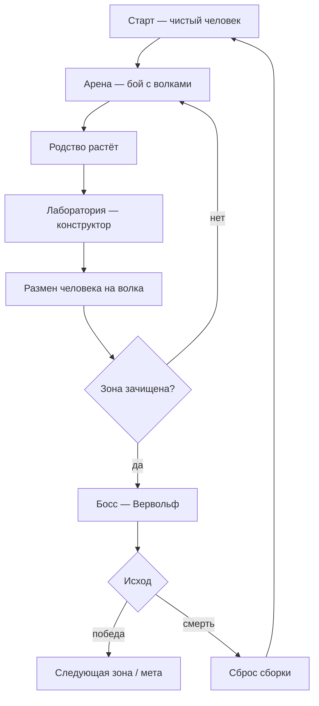

### Структура забега

**Рогалик по флоу, а не по луту.** Вариативность живёт в структуре прохождения, а не в наборе перков — конструктор остаётся полностью видимым и детерминированным.

- Зоны/экосистемы идут процедурным порядком; состав и количество зверья — случайны
- Босс зоны даёт много родства под свой видовой состав
- Билд не выбирается в вакууме — он вырастает из того, какой маршрут и каких боссов подкинул забег: входные данные (родство по видам) рандомизированы маршрутом
- Когда химеризация обкатана — добавляются враги-химеры, а боссы становятся суперхимерами
- **Цель сектора — отключить сигнализацию** (контрольный узел зоны): открывает путь глубже. Воющая тревога привлекает и спавнит врагов; отключил узел — сектор затихает. Темп важен: чем дольше копаешься, тем больше успевает сожрать Химера 0 (разд. 7). Многосекторная структура — с v1.0; в MVP один сектор.

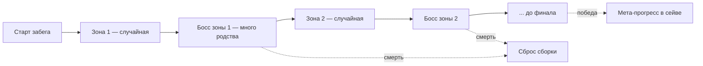

### Забег и смерть

Классический рогалик: при смерти сборка сбрасывается, долгосрочный прогресс несёт мета-слой (разд. 10).

| Сбрасывается при смерти | Переносится между забегами (мета) |
|---|---|
| Сборка: аугументы, шасси, пул мутагена | Постоянные разблокировки (доступ к видам/аугументам/шасси) |
| Состояние шкалы мозга | Мета-валюта прогрессии |
| Родство, накопленное за забег | — |

---

## 5. Химеризация (ядро)

Ядро MVP. Игрок перекраивает тело, разменивая человеческие органы на звериные.

### 5.1 Аугументы и слоты

**Архитектура: слот = ветка.** У каждого орган-слота своя мини-ветка взаимоисключающих вариантов; выбираешь по одному на слот. «Дерево перков» = объединение пер-слотовых веток (визуально — созвездия, разд. 6). Слоты — органного уровня (не крупные зоны тела). Свап в слоте = органический переморфинг.

**Принцип масштаба:** один орган = семейство механик. В MVP — **по одной читаемой механике на слот**; всё прочее (рык, вой, ловушки, речь/команды и т.п.) — в Бэклог (разд. 12). Архитектура «слот = ветка» поглощает добавление позже без переделки.

**Правила сборки (MVP):**

- Без рандома — весь набор видим, выбор осознанный.
- Перестановка свободная (в будущих версиях регулируется уровнем сложности).

**Слоты прототипа (человек ↔ волк ↔ змея — слот циклирует по донорам):**

| Слот (орган) | Человек | Волк | Змея |
|---|---|---|---|
| **Чутьё** | быстрый откат рывка | Нюх — запаховые тропы (следы видны) | Пит-орган — термозрение: тепло сквозь стены |
| **Пасть** | — (укуса нет) | укус + **вой-стан** | Ядовитые клыки — укус сильнее + **яд** (стаки) |
| **Руки** | оружие, инструменты | раздирающий коготь, нет оружия | — |
| **Ноги** | баланс, **пинок** | скорость, быстрый рывок | — (ходовая часть шасси, не крадётся) |
| **Сердце** | реген вне боя | реген всегда (и в бою) | Хладнокровное — HP+реген, **невидим термозрению** |
| **Шкура** | база | шерсть: броня | Чешуя — броня + **камуфляж-в-неподвижности** |
| **Хвост** *(только химерный слот)* | — | — | Змеиный хвост — **обхват**-удержание (F) |

- **Урон Пасти принадлежит УКУСУ, не мечу** — клыки не усиливают оружие Рук.
- **Пасть = развилка билда:** волчья (вампиризм-лечение укуса + вой) ↔ змеиная (урон + яд). Причём вой-стан — козырь против змеиного обхвата (рвёт его на ст.1–2): взял яд — потерял страховку.

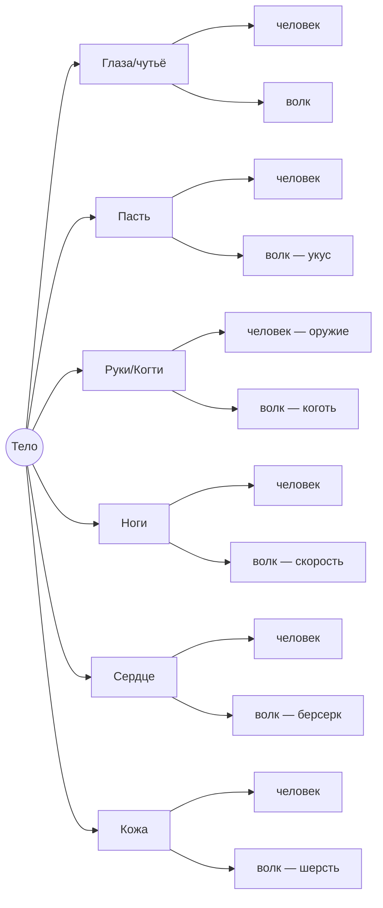

- **Голова — концептуальный якорь:** в ней сходятся чувства, пасть и мозг-индикатор. Сейчас сенсорика свёрнута в один слот «Чутьё» (нюх волка ↔ термо змеи — уже реальный выбор чувства); post-MVP голова расщепляется — глаза/уши/нос становятся отдельными слотами под разные виды (уши летучей мыши = эхолокация). Здесь концентрируется будущая глубина перцепции (разд. 5.5).
- **«Руки» — носитель главного трейдоффа** (коготь мощнее, но забирает оружие). Два атакующих слота (Руки + Пасть) дают гибрид «оружие + укус» — химера между полюсами уже на двух видах.

### 5.2 Экономика

Два рычага: **родство** (скидка) и **пул мутагена** (ёмкость). В MVP все 6 слотов открыты сразу, билд гейтит только пул + стоимость.

- **Человек — не бесплатная база, а полная конфигурация.** На старте человеческие органы занимают все 6 слотов, но пул заполняют **не впритык — остаётся свободный запас очков**. Этот запас и есть стартовый бюджет на химеризацию.
- **Звериный орган дороже человеческого, который он заменяет.** Снимаешь человеческий (возвращаешь его очки) → ставишь звериный; разницу добиваешь из свободного запаса, а **родство удешевляет звериный**, пока он не влезет. Снято человеческого / вложено в зверя = позиция на шкале мозга.
- **Родство: скидка + мощь.** Фаза 1 (0–80) — скидка на органы вида; фаза 2 (80–100) — экспрессия ×1…×2. Скидку на орган даёт родство ИМЕННО его вида (волчьи — от родства-волк, змеиные — от родства-змея). Кап 100.
- **Совместимость — через стоимость, не запрет.** Аугумент в слоте, не нативном для текущего шасси, стоит **мультипликативно дороже** (хвост человеку приживить можно — просто дорого). В MVP не бьёт: все 6 волчьих вариантов идут в нативные человеческие слоты. Дешёвая альтернатива графту — химерные слоты (мета, разд. 10).
- **Единая формула стоимости:** `стоимость = база × наценка_вида × множитель_не-нативного_слота × скидка_родства`. Никаких жёстких банов — только цена.

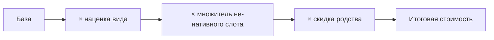

- **Прогресс внутри забега — эмерджентный:** волки → родство ↑ → звериные органы дешевеют → можешь разменять больше человеческих органов на звериные → дрейф в зверя к финалу. Кривая забега = кривая химеризации. (Пока родства нет — дерёшься чистым человеком; озвереваешь, наохотившись.)

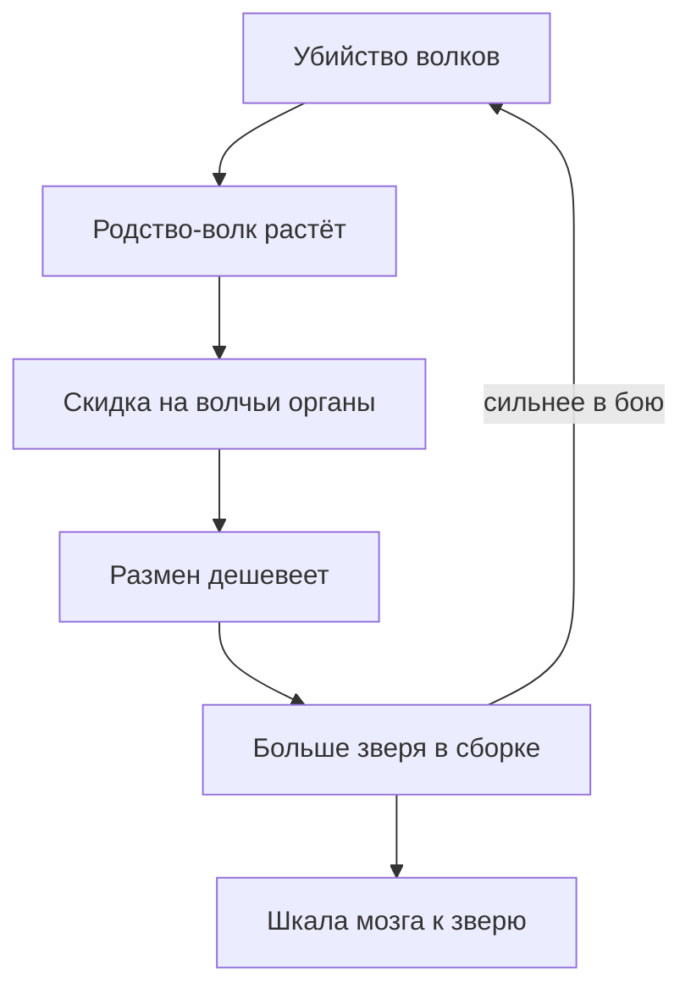

- **Расширение пула — наградой суперхимеры** (реализовано: +4 к пулу за ПЕРВОЕ убийство типа босса, разд. 10). Многозонное внутризабеговое расширение — v1.0+.
- **Общая модель:** пул = ёмкость под все аугументы (на старте занята человеком), родство = скидка по виду, человек — тоже вид. В прототипе уже два донора (волк, змея): слот циклирует человек → волчий → змеиный, пул гейтит глубину микса.
- Числа (база пула, стоимости, кривая скидки) — балансные дилы для прототипа.

### 5.3 Шкала мозга

Не слот — динамический индикатор химеризации, следствие решений игрока (= доля звериных слотов).

| Чистый человек | Полная химера |
|---|---|
| Тактика, контроль, осознанность | Инстинкты, ярость, звериное чутьё |
| Эффективное использование оружия | Берсеркер, физическое превосходство |
| Осознанное управление аугументами | Потеря контроля — как боссы-химеры |

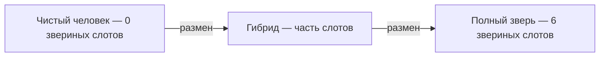

Цена движения к полному зверю — открытый вопрос (разд. 12). В MVP — только индикатор, без механической цены.

### 5.4 Человек как билд

- Единственный, кто эффективно использует оружие, инструменты, ловушки
- Человеческое родство качается через выживание без звериных аугументов
- Ветка открывает изобретения, боевые техники, анализ врагов (содержимое — в Бэклоге, разд. 12)
- **Два полярных билда: чистый человек vs полная химера. Всё интересное — между ними.**

### 5.5 Восприятие

**Принцип.** Аугументы восприятия меняют не цифры — а то, как игрок видит и слышит мир. Каждое чувство биологически честно: оно эволюционировало для конкретной среды и раскрывается только в ней.

> Нюх бесполезен в стерильной комнате. Эхолокация слабее в открытом поле, чем в пещере. Вибрационное чутьё на камне работает иначе, чем на земле. Так работает биология.

| Аугумент | Тип восприятия | Среда раскрытия |
|---|---|---|
| Волчьи глаза | Дихроматическое сумеречное зрение + запаховые следы туманом + усиленный слух | Лес, ночь, охота — читаешь следы, знаешь откуда придут враги |
| Летучая мышь | Эхолокация — пульсирующие волны обрисовывают силуэты | Тёмные пещеры и коридоры — полный контроль в темноте |
| Паук / скорпион | Вибрационное чутьё — чувствуешь движение через поверхность | Каменный пол, земля — засада и раннее обнаружение |
| Птицы (орёл, сова) | Тетрахроматическое зрение — мир неоново яркий, 4 пигмента | Открытые пространства, высота — видишь детали недоступные человеку |
| Пчелиные глаза | Расширенный диапазон — ультрафиолет | Тропики, цветущие зоны — видишь паттерны невидимые другим |
| Хамелеон | Независимые глаза — обзор 360° | Любая среда — невозможно зайти сзади |
| Змея | Термозрение — видишь тепловые силуэты | Темнота, засада — идеальный охотник в темноте |
| Крокодил | Давление воды и вибрация через кожу | Водная среда — чувствуешь движение в воде |

**Нарративное значение.** Чем больше звериных аугументов восприятия — тем дальше уходит человеческая картина мира. Мир перестаёт выглядеть человеческим постепенно, не резко. Игрок замечает не сразу.

**Реализовано в прототипе — экосистема чувств («камень-ножницы-бумага»).** Зрение (рвётся стенами) ↔ нюх (запаховые тропы — контрит скрытность) ↔ термозрение (тепло сквозь стены — слепо к холоднокровным) ↔ скрытность (камуфляж-в-неподвижности; зацепки — гремок и запах). **Новое чувство = ОСЬ на всех телах**: сенсорная сторона + эмиттерная + дефолт-без-правок + маркер-исключение + RPS-проверка + симметрия игрока (рецепт — `CONSTRUCTOR_GUIDE`). Симметрия работает в обе стороны: украл змеиное Сердце — сам невидим термозрению змей; украл Пит-орган — сам видишь тепло. Читаемость сигналов — единая цвет-легенда: телеграф = СВОЁ действие существа, статусы (белёсый «выключен из боя») — от любого источника.

**Камера от восприятия (v1.0+).** Камера — не фиксированный выбор и не ручной тоггл, а следствие органов. Восприятие проецируется на **плоскость** или **сферу**, а «камера» — это точка и дистанция обзора этой поверхности.

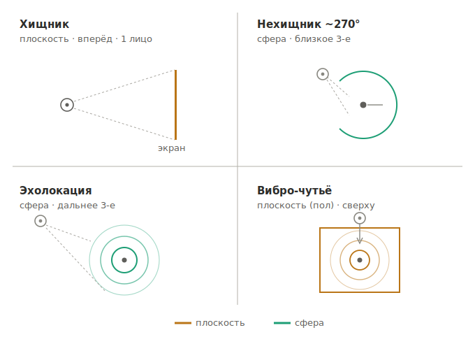

- **Рамочные чувства** задают поверхность и вид: хищник (бинокуляр вперёд) → плоскость, 1 лицо; нехищник ~270° → сфера, близкое 3-е; эхолокация → сфера, дальнее 3-е (видишь себя внутри); вибро → плоскость-пол, вид сверху.
- **Накладочные чувства** (нюх-туман, тепло, UF, эхо-пульсы) рисуются слоями поверх активной поверхности и **сливаются в один кадр** — без врезок.

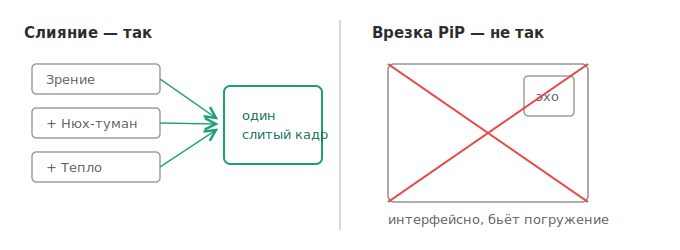

- **Переключаешься** между своими рамочными чувствами = активная поверхность/вид (старый тоггл «1/3 лица» становится «смотреть сквозь свой орган»). В родной поверхности чувство в полной чёткости, иначе деградирует до наложения — это даёт тогглу механический вес.
- **Польза:** камера = механика и ось билда; нехищные сенсоры получают идентичность (оборона, тебя не флангануть); дрейф шкалы мозга виден в самой точке зрения.
- **Реализация:** дёшево — плоскость + сфера-меш, сенсорика как материал/шейдер, камера ездит (ложится на low-poly + пост-пасс).

**В MVP.** Сенсорное правило выключено — и человек, и волк «хищник, взгляд вперёд» (оба дали бы 1 лицо). Поэтому в MVP **ручной тоггл 1/3 лица**: третье лицо нужно, чтобы наблюдать переморфинг тела. Камера-от-восприятия включается с v1.0+, когда появятся виды с разными рамками (мышь, насекомые, нехищники).

### 5.6 Шасси (расширение, post-MVP)

Шасси определяет, какие слоты вообще существуют. Смена шасси — радикальный обмен, не улучшение; открывается как финал ветки родства.

> **Смена шасси игрока — по-прежнему post-MVP.** Но фундамент уже стоит: прототип держит три вида на УНИВЕРСАЛЬНОМ теле (шасси + органы × экспрессия — игрок, волк, змея и вервольф собраны одной системой). Слот — атрибут шасси; ходовые части («Тело» змеи) помечены `chassisOnly` и аугументами не крадутся. Не-нативные органы живут в химерном слоте (×2). Нага/кентавр = СПЛАВ шасси, не смена — Бэклог.

| Шасси | Уникальные слоты | Особенность |
|---|---|---|
| Человек | Руки ×2, ноги ×2, голова, торс, кожа | Оружие и инструменты — только здесь |
| Волк | Лапы ×4, морда, хвост, торс, шерсть | Теряет руки → нет оружия |
| Летучая мышь | Крылья-руки ×2, лапы ×2, морда, хвост | Эхолокация, полёт в темноте |
| Медведь | Лапы ×4, морда, торс, шерсть | Максимальная масса и броня |
| Орёл | Крылья ×2, когти ×2, клюв, хвост, перья | Вертикальность, пикирование |
| Змея | Тело-сегменты, пасть, чешуя | Совсем другая мобильность |
| Крокодил | Лапы ×4, пасть, хвост, броня-кожа | Полуводный — суша и вода |
| Осьминог | Щупальца ×8, тело, хроматофоры | Захват, стелс, вода |

---

## 6. Конструктор — UI и лаборатория

Меню «бумажная кукла», стилизованное под **анатомическую тетрадь да Винчи** — диегетично: это тетрадь самого учёного-ренессансника, изучающего и тело, и небо. Контраст с миром (мрачный low-poly) = линза учёного, его выверенный ум против дикого мира.

**Раскладка экрана:**

- В центре — **витрувианская фигура-химера**, морфит органически по мере свапов (видно, что меняешь и как дрейфует шкала мозга).
- **6 слотов** — выноски-аннотации на полях: название, текущий вариант, цена, краткий эффект, со сравнением «оставить ↔ сменить».
- Внизу — **пул мутагена** (запас очков) и **шкала мозга** (маркер = доля звериных слотов).

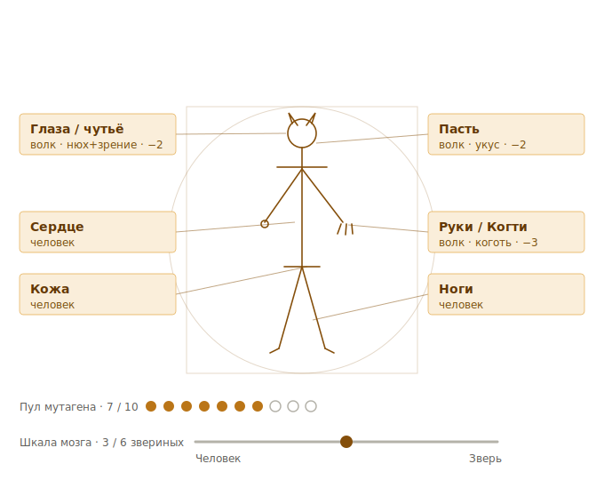

**Родство = созвездия.** Прогресс родства подан как звёздные карты — по созвездию на вид, и это **реальные звериные созвездия** (Волк = Lupus, орёл = Aquila, медведь = Ursa, змея = Serpens/Hydra, скорпион = Scorpius). Бестиарий = звёздный атлас; «дерево перков» = небесная карта. Каждая звезда = аугумент вида; родство = яркость созвездия (в MVP видно целиком: родство = скидка/яркость, не анлок).

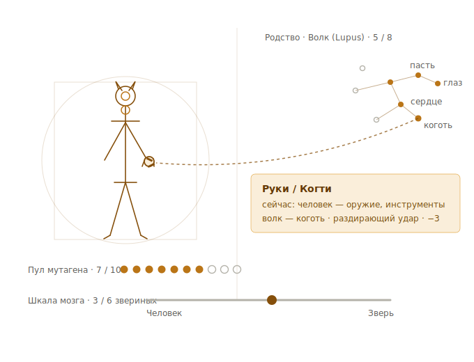

**Взаимодействие:**

- **Поставить:** тянешь звезду из созвездия → её анатомический слот подсвечивается → дроп = фигура морфит, пул списывается, шкала мозга сдвигается. Цена со скидкой родства видна сразу; не хватает — слот краснеет, звезда не встаёт.
- **Снять:** звезду обратно в небо (или ПКМ) → очки возвращаются, часть тела реморфит к человеку. Свободно (перестановка в MVP без штрафа).
- **Применение мгновенное** по дропу (превью = результат), фиксируется по выходу из тетради. Модального «подтвердить» нет.

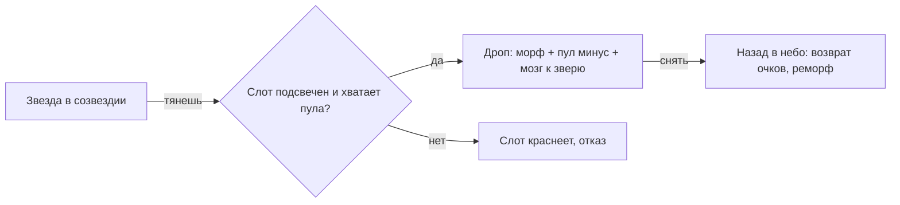

(Идея органического UI — в Бэклоге, разд. 12.)

---

## 7. Боссы

Боссы — коллеги, заражённые Химерой 0 (нарративная роль — разд. 3). Каждый воплощает дальний полюс шкалы мозга: разум зверя победил. **Химера 0** — апекс и финальный босс (эндгейм, разд. 11).

> **Химера 0 — растущая угроза (future).** Адаптируется под любой вид и крепнет, пожирая (людей, павших, их черты) — к финалу это композит всего поглощённого. Чем дольше забег и чем больше секторов оставлено непацифицированными, тем сильнее Химера 0 в финале: **темп vs мощь** — тянешь время ради родства/билда, растёт и она. Заодно это естественный скейлер сложности против мета-пауэр-крипа (разд. 10).

### Вервольф (MVP)

Химера человек + волк. Простая читаемая комбинация, которая сразу показывает, что химеризация работает и к чему ведёт. Ближайший коллега учёного — **первый, кого заразила Химера 0**. Разум волка захватил его полностью.

- Сильный противник с уникальной анатомией химеры — без фаз, без переключений
- Скорость и сила волка — агрессивный ближний бой
- Шкала мозга на максимуме зверя — берсеркер без тактики
- Тестирует базовую механику боссов и читаемость химеры визуально
- Нарративный вес — первая встреча с тем, чем можно стать
- Криатур-эталон силуэта — вервольф из «Ван Хельсинга» (см. разд. 9 «Язык трансформации»)

**Реализовано в прототипе.** Вервольф собран как настоящая суперхимера тем же конструктором, что и игрок: человеческое шасси + полный волчий сет × экспрессия 2 (= потолок игрока на 100 родства) + вечная ярость (+урон/+скорость/−защита) — «быстрый убийца, не танк». Приёмы: укус-вампиризм (temp HP свыше максимума), прыжок, чардж-разбег с наскоком, вой-призыв стаи (Rally + сбор со всей карты). Массивная туша (`Massive`): обхват игрока держит его на стадию слабее. Призывается по родству ≥80; **первое убийство типа → +4 пула + химерный слот** (разд. 10).

---

## 8. Мир — зоны и виды

Лаборатория — Ноев ковчег безумного учёного. Каждая комната воссоздаёт отдельную экосистему. Когда Химера 0 вырвалась — комплекс **окукливается**: органика запечатывает сектора, и каждая зона стала очагом хаоса. Продвижение = отключение сигнализации сектор за сектором (см. разд. 3).

| Сектор-биом | Виды | Босс зоны (2 вида сектора) |
|---|---|---|
| **Лес** — старт (MVP) | волк, медведь, ёж, сова, летучая мышь, жук-олень | **Вервольф** (человек + волк) · *в прототипе: волк + змея (обкатывается в стартовом биоме; финальная прописка змеи — Джунгли, за дизайном)* |
| **Горы** | орёл, снежный барс | Орёл-барс — скорость и высота |
| **Джунгли** | тигр, барс, хамелеон, змея, богомол | Хамелеон-богомол — засада и точность |
| **Болото** | крокодил, лягушка, шершень, сколопендра | Крокодил-шершень — броня и яд |
| **Пустыня** (камень) | скорпион, паук | Скорпион-паук — яд и вибро-засада |
| **Саванна** | гепард, бизон | Гепард-бизон — рывок и таран |
| **Море** (аквариум) | акула, касатка, осьминог, краб, черепаха | Осьминог-акула — захват и скорость |

*Принципы: зона = один биом · у каждого вида один дом · босс = химера из двух видов своей зоны · MVP = Лес, фауна = только волк. Убраны: Подземелье (стало Лесом), Северное море (→ Море), Тундра и Вольер (своей фауны нет; летуны разнесены по биомам). Состав видов — стартовый, дальше за арт-/нарратив-командой.*

---

## 9. Арт-дирекшен и гейм-фил

### Визуальный стиль

Высокопроизводительная **low-poly** графика с «сочной» картинкой. Сочность — не в полигонах и текстурах, а в свете, атмосфере и пост-обработке поверх дешёвой геометрии.

| Реф | За что отвечает |
|---|---|
| **VOIN** | Тон и настроение — мрачное, высококонтрастное, брутальное, гор |
| **Valheim** | Техника дешёвой красоты — low-poly геометрия + свет, объёмный туман, цветокор |
| **Boltgun** | Гейм-фил — вес + скорость, impact-фидбек |

**Бюджетный трейдофф:** низкая геометрия осознанно покупает бюджет на свет, туман, реалтайм-тени, воду, VFX. «Высокая производительность» и «сочность» не даром обе сразу — экономия на полигонах перекладывается в освещение и эффекты.

**Синергии со стилем:**

- Low-poly первичен по силуэту → помогает читаемости химер (узнаёшь «человек+волк» по контуру)
- Перцепция (термо/эхолокация/неон) — пост-пассы поверх геометрии; low-poly силуэты под ними читаются чище
- Цветокор/LUT по зонам → каждая экосистема ощущается своей почти бесплатно на одних ассетах

### Гейм-фил

Эталон ощущения — **Boltgun**: «инертный, но быстрый». Масса и скорость одновременно — тяжёлый импульс, но мгновенный отклик.

**Принцип:** вес фейкается визуально (анимация, камера, импульс), ввод остаётся мгновенным. Тяжёлый *ввод* = лаги, а не мощь.

**Фил как измерение билда.** Химеризация меняет не цифры, а то, как тело ощущается в управлении. Шкала мозга и шасси — это профили массы/скорости:

| Профиль | Ощущение |
|---|---|
| Человек | Лёгкий, точный, отзывчивый, тактический |
| Полный зверь | Тяжёлый, импульсный, брутальный — «инертный но быстрый» несущийся хищник |
| Медведь (после MVP) | Тяжёлый, медленный, сокрушительный |
| Волк (после MVP) | Лёгкий, быстрый, неотступный |

**Impact-фидбек — приоритет, не «эффекты потом».** Главный и самый дешёвый источник сочности в ближнем бою:

- Хитстоп на попадании
- Кик камеры + лёгкая тряска
- Толчок/выпад — коготь/пасть «упираются» при контакте
- Партиклы, кровь, мясной звук

В MVP куб-стадия фил не покажет — сочность приходит на отдельном пассе света/пост/VFX после того, как цикл заработает.

### Язык трансформации

Химеризация выглядит **органично, не как вивисекция** — тело само отращивает черты (мутаген = восприимчивость к видам), а не получает хирургические импланты. Ужас не в швах, а в телесной неправильности.

- **Два слоя (принятый компромисс):** модульность живёт в системе/UI (слоты, свапы), органика — на теле. Аугумент *прорастает* (когти из руки, мех, перестройка кости); свап = переморфинг, а не перестановка детали.
- **Low-poly это упрощает:** свап low-poly меша + короткая мясная VFX-вставка читается как «отрастил», без детального разрыва кожи.
- **Визуальные якоря шкалы мозга:** человек → частичные звериные черты → полный зверь. Эталон полного волчьего полюса — вервольф из «Ван Хельсинга» (Хью Джекман): крупный, двуногий, звероподобный, человек ушёл. Аватар игрока интерполирует к этому силуэту по мере химеризации; **босс Вервольф = этот полюс воплощён** — предупреждение о том, чем можно стать.
- **Феасибилити:** low-poly вервольф-полюс уже доказан в Valheim (Fenring/культисты, Ульвы в горах) — амбициозный криатур-дизайн и дешёвый стиль совместимы.

---

## 10. Мета-прогрессия (future, не MVP)

Убийство боссов-суперхимер → **разовая награда за ТИП босса** (первое убийство; повторные того же типа дают только обычное родство). Постоянна в сейве (перманентность — с мета-сейвом; до него прототипируется В СЕССИИ, как родство/`AffinityTracker`). **Вервольф = первая суперхимера** (коллега: человек-шасси + сыворотка + волчьи ауги) — на нём и обкатывается луп; реализация — компонент `SuperBossReward` на префабе босса (тип + пул + выдача химерного слота), отдельно от родства (родство даёт КАЖДОЕ тело).

- **Расширение пула** + **химерный слот** — доп-слот, добавляемый к шасси. Химерные слоты = «заработанный дом» для не-нативных органов (альтернатива дорогому графту через множитель, разд. 5.2) и путь к мифическим body plans (Бэклог). **РЕАЛИЗОВАНО в прототипе** (+4 пула + 1 слот за первое убийство вервольфа, цена органа в слоте ×2, лимит 1): второе сердце волк+змея работает, «Змеиный хвост» с обхватом живёт именно здесь.
- **Супремум-стек (РЕАЛИЗОВАН):** повторяющиеся бонусы ВНУТРИ химеры (одна ось от нескольких органов) складываются НЕ аддитивно, а по **супремуму** (скаляр → `max`, кулдауны → `min`, булево → `OR` = поточечный join). Дубль оси не растит силу (второе сердце ≠ ×2 реген) → окупается только НОВЫМ направлением (змеиное сердце = холоднокровность) → микс вознаграждён алгебраически. Агрегация — по типу слота органа; без дублей `join == сумма`, расходятся ровно на дубле из химерного слота.
- **Сеты:** доп-перки за число надетых органов одного вида (брейкпоинты 2/4/6, как грин-сеты Diablo 3). Усиливаются с ростом родства.
- *Баланс «моно ↔ микс»:* сеты тянут к специализации, но при достатке слотов добираешь брейкпоинты НЕСКОЛЬКИХ видов = стек мульти-сетов = микс вознаграждён (это и есть химера). Условие: бонусы порогами (не линейные) и гибрид остаётся конкурентен чистому виду. Вечный tug-of-war: на моно тянут скидка родства + сеты + дрейф; на микс — кросс-видовые синергии + мульти-сет стек + сама фантазия. Обе стороны должны быть жизнеспособны.
- *Осторожно:* пул + слоты + сила сетов копятся между прогонами = **многоосевой пауэр-крип**, классическая ловушка рогалика. Нужны растущая сложность / софт-капы, иначе выровняет челлендж. Центральный баланс-вопрос меты. Частичный естественный контр-скейлер — растущая Химера 0 (разд. 7): финальный босс усиливается с темпом игрока.

---

## 11. Дорожная карта и MVP

| Стадия | Контент | Механики |
|---|---|---|
| MVP | Одна арена, волки, босс Вервольф | Базовый цикл, конструктор, родство, шкала мозга |
| v1.0 | **Лес целиком** — наземные + полёт, 4-5 видов, первые боссы | Шасси, синергии, записки, восприятие базовое, камера от органов (старт), процедурные комнаты |
| v2.0 | Остальные наземные биомы — горы, джунгли, болото, пустыня, саванна | Полный рогалик, восприятие по средам, боссы каждой зоны, первые враги-химеры |
| v3.0 | Море — водные виды; вертикальность | Зональная физика — вода, воздух, вертикальность |
| Эндгейм | Все зоны, все виды, полный ковчег | Климатические экосистемы, мета-прогрессия, боссы-суперхимеры, **финальный босс — Химера 0 (обретшая разум)** |

### MVP — минимальный прототип

- Один вид противников — волки
- Босс-химера — Вервольф (человек + волк)
- Только человеческое шасси (смена шасси — после MVP); волк присутствует как набор аугументов поверх человека
- Конструктор — 6 органных слотов, базовые аугументы человек↔волк
- Перцепция — упрощённый бонус (ручной тоггл 1/3 лица, без смены восприятия)
- Одна арена + лаборатория, две двери
- Простые кубики вместо моделей
- Один полный цикл: бой → лаборатория → изменение → бой → босс

*Всё остальное — после того как цикл ощущается правильно.*

### Статус прототипа (июль 2026) — MVP пройден и превзойдён

Сверх MVP-списка уже играется: **второй вид** (змея: яд-стаки, термозрение, 3-стадийный обхват с ратчетом, камуфляж-в-неподвижности + гремок, спавнер скрытых засад); **экосистема чувств** (RPS: зрение↔нюх↔термо↔скрытность); **мультидонор** (слот циклирует по видам); **химерный слот + супремум**; **награда суперхимеры** (+пул, +слот, разово-за-тип); **обхват игрока** («Змеиный хвост», стадии, `Massive`-градация); статусы (ярость, яд, стан/стаггер-таксономия, холоднокровность, камуфляж); вой-стан и пинок игрока; тактика стаи (жетоны, кольцо, мораль, захват-с-наскока); универсальное тело NPC (экспрессия); единая цвет-легенда сигналов; процедурная арена + NavMesh. Дальше по плану: **интерфейс** (анатомическая фигура = боевой индикатор + ядро конструктора), затем **третий зверь** (кандидаты: сова — эхолокация/ось шумности; лось — второй `Massive`, копыто).

### Принципы наращивания (после MVP)

Как растёт игра, чтобы охват не сожрал. Производственная единица — **способность движения**, не отдельный зверёк.

**Две парадигмы движения:**

- **Наземная (2.5D по поверхностям):** ходьба → лазание → ползание. Привязка к земле + гравитация — одно traversal-ядро.
- **3D-объёмная:** полёт ≈ плавание (6-DOF, свободное движение, драг вместо гравитации). Ядро общее; вода добавляет плавучесть/течения/дыхание, полёт — подъём/воздушный бой.

**Порядок:**

1. **Лес (биом №1) — полный вертикальный срез**, ломающий ОБЕ парадигмы: наземные (волк/медведь/ёж) → насекомое (жук-олень) → летающие (сова, летучая мышь = полёт = 3D-ядро). Это завод-эталон: морф-пайплайн, ИИ, перцепция, сборка биома доказаны вместе на одном биоме.
2. **Наземные биомы дальше** — контент-реюз на готовых наработках Леса (новые виды на уже построенных ступенях).
3. **Океан — последним.** 3D-ядро уже оплачено полётом → остаётся водный слой (плавучесть, течения, зрение сквозь воду). Не отдельная игра, а «почти готовое 3D + водная косметика».

**Правила:**

- Внутри биома — по локомоции (ходящие → лазающие → рептилии/амфибии → насекомые → летающие). Каждый класс = тех-веха, не «ещё зверёк».
- **Кап ~5 видов на биом** — не раствориться в разнообразии (и хватает на босса-комбо из двух видов).
- Сначала доказать «вау» на MVP-цикле (один биом, одна боевая схема, один проблеск перцепции) — только потом заселять.

---

## 12. Бэклог

### Айсбокс (отложенные механики, post-MVP)

- **Человек:** речь → магия / голосовое управление техникой; ловушки; мастерство оружия. Питает ветку «Человек как билд» (разд. 5.4).
- **Волк:** рык (вой РЕАЛИЗОВАН — вой-стан игрока от волчьей Пасти; вой-зов и вой-призыв у NPC).
- Полный органный список слотов (сердце/лёгкие/печень/желудок/… + шасси) разворачивается с новыми видами.
- **Химеризация шасси / СПЛАВ шасси (далёкое будущее):** свободная перестройка телесного плана — нага, кентавр, змеиная голова вместо хвоста, несколько голов, мифические существа. За пределами «смены шасси» — переизобретение body plan (НЕ путать с доп-частью тела через химерный слот: хвост при живых ногах — уже в игре). Встаёт в ту же формулу стоимости как «очень дорого», а не как особый случай.

### Открытые вопросы

- **Цена химеризации.** Цена и последствия движения к полному зверю намеренно не зафиксированы. Потеря контроля как механика пуста, пока в мире нет социального слоя — без союзников и людей это просто стенка или ещё одна концовка. Направления: человек — тоже вид химеризации, охота на людей возвращает человеческое родство/контроль; моральная дилемма — спасать людей, будучи зверем, возвращает человечность. В MVP — без механической цены.
  - **Тематический движок (соавтор):** «долго сражаясь с драконом, сам обретаешь звериный лик» (по Ницше). Сила игрока = та же сыворотка, что у Химеры 0, поэтому полный зверь = риск самому стать апексом, как она. Это **player↔Химера-0 зеркало** (не конфликтует с боссами-жертвами) и возможная point-of-no-return цена на пике шкалы мозга.
- ~~**Каноническая камера для перцепции**~~ → **решено** (v0.14): камера эмерджентна из восприятия — проекция на плоскость/сферу, рамочные/накладочные чувства (разд. 5.5).
- **Органический UI конструктора.** Древо/созвездия как растущая биология/нервная система вместо стерильной тех-сетки — чтобы и системный слой ощущался живым.

---

*— конец документа v0.17 —*
