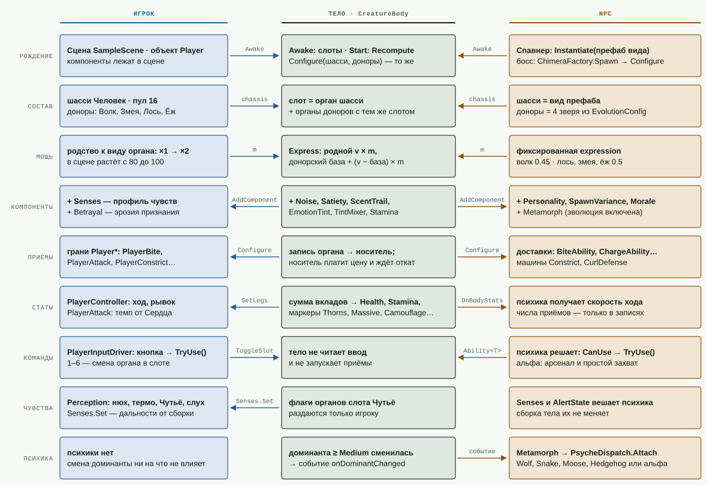
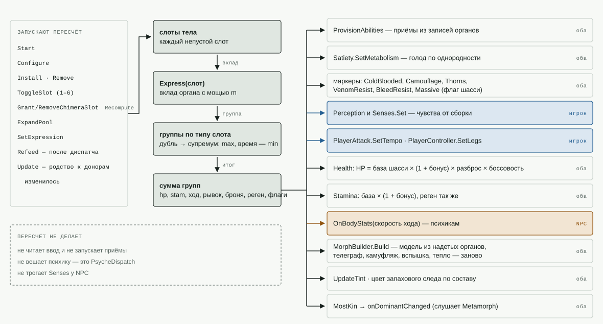
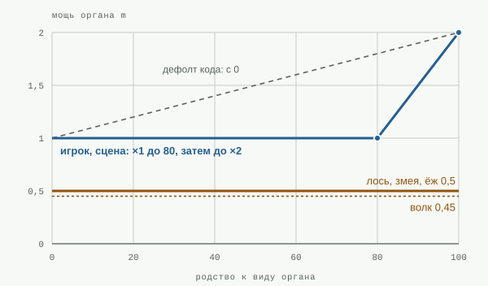
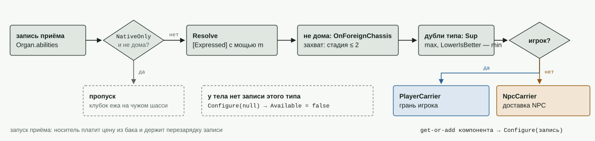
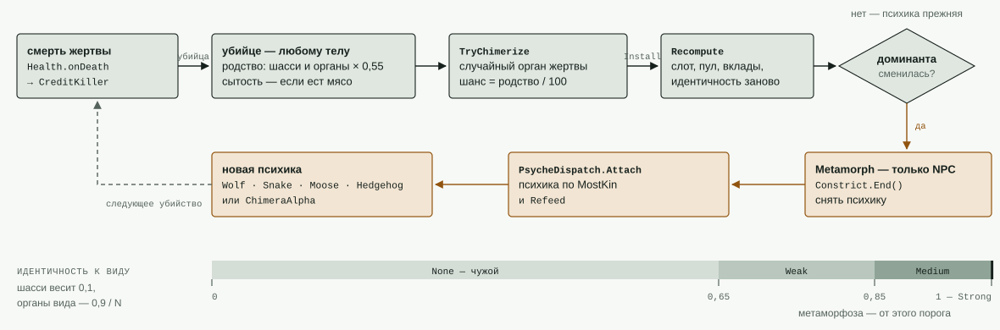

# Анатомия тела: игрок и NPC

- **Что это:** схемы устройства тела игрока и NPC — снимок по коду и сцене на 16.09.2026, после спеки
  `2026-09-16-dovodka-dannyh-v-organah.md`. Не детектор: подписи сверены руками и записаны в генераторе
  `Docs/tools/anatomiya_tela.py`. Поменялось устройство тела — сверить и перегенерировать.
- **Правила** конструктора живут в `CONSTRUCTOR_GUIDE.md`; как тело собирается в метрах и стыках — `УСТРОЙСТВО_ТЕЛА.md`
  и генерируемые `Диаграммы/`. Здесь — как части тела связаны между собой.
- **Одной фразой:** игрок и NPC — один и тот же `CreatureBody`. Различаются четыре вещи: как тело рождается, откуда
  берётся мощь органа, кто исполняет приём и кто отдаёт команды.

Цвета на схемах: синее — только у игрока, охра — только у NPC, серо-зелёное с чёрной рамкой — общее тело.

---

## Рис. 1. Одно тело, два водителя

По строкам — что одинаково и что расходится. Стрелки — настоящие вызовы и поля между телом и сторонами.

- **Рождение.** Игрок лежит в сцене готовым объектом; NPC-вид рождается спавнером из префаба, босс и химеры —
  `ChimeraFactory.Spawn` через тот же конструктор, что у игрока.
- **Мощь органа.** У игрока — родство к виду органа (×1…×2), у NPC — фиксированная экспрессия вида.
- **Приёмы.** Одна запись органа кормит грань игрока или доставку NPC. Носитель сам платит цену из бака и держит
  перезарядку записи; психика только спрашивает «можно ли сейчас» (`CanUse`) и решает, чем бить.
- **Команды.** Тело не читает ввод и не запускает приёмы: у игрока это делает `PlayerInputDriver`, у NPC — психика.
  Химера-альфа бьёт всем арсеналом тела и хватает простейшим образом — одну цель, когда рядом нет других.

Источники: `CreatureBody.cs` (Awake, Recompute), `CreatureBody.Abilities.cs`, `PsycheDispatch.cs`, `Metamorph.cs`, `ChimeraAlphaPsyche.cs`, сцена `SampleScene`, генераторы `*Prefab.cs`. Разброс особи и личность в сцене выключены (`IndividualityConfig` = 0).

## Рис. 2. Пересчёт тела

`Recompute` — единственное место, где состав превращается в поведение. Слоты раскрываются в вклады органов, дубли
одного типа слота сводятся супремумом, группы суммируются — и итог расходится по получателям, какие лежат на объекте:
общим (здоровье, выносливость, маркеры, модель, цвет), игроку (чувства, ход, темп удара) или психике NPC (скорость хода).

Порядок раздачи справа — порядок строк в `CreatureBody.Recompute`. Модель строится у любого вида, у шасси которого есть места (`sockets`), игрок — так же.

## Рис. 3. Мощь органа

Мощь m — единственная ручка, через которую орган раскрывается в числа. Её источник — главное различие игрока и NPC.

| орган | закон |
|---|---|
| родной орган шасси | `v × m`; времена — как записаны |
| донорский в родном слоте | `база + (v − база) × m`, база — вытесненный родной орган |
| донорский в химерном слоте | `0 + v × m` |
| записи приёмов | поля `[Expressed]` — тем же законом; урон всех приёмов раскрывается так |

`BonusMultiplier`: если `expression` > 0, возвращает её; иначе линейно ×1…×2 по родству от `bonusStartAffinity` до `bonusFullAffinity`. В сцене у игрока старт 80, в коде дефолт 0.

## Рис. 4. Приём из записи органа

Записи лежат в органе. Тело раскрывает их при каждом пересчёте и отдаёт носителю своей стороны; носитель сам платит цену приёма и держит его перезарядку.

| приём · запись | органы с записью | NPC | игрок | цена и откат у носителя |
|---|---|---|---|---|
| Укус · `BiteData` | Пасть волка, Ядовитые клыки, Цепкая пасть | `BiteAbility` | `PlayerBite` | откат 0,7 |
| Наскок · `LeapData` | Волчьи ноги, Тело-хвост | `LeapAbility` | нет | цена 30 и 20 |
| Удар конечностью · `LimbStrikeData` | Кисть, Коготь, Копыто | `LimbStrikeAbility` | `PlayerAttack` | NPC: откат 1,1; игрок: темп Сердца |
| Пинок · `KickData` | Ноги человека | нет | `PlayerKick` | откат 1 |
| Рога · `AntlerData` | Рога | `AntlerAbility` | `PlayerAntler` | откат 2,5 |
| Таран · `ChargeData` | Лосиные ноги | `ChargeAbility` | `PlayerCharge` | разбег NPC: цена 70 |
| Залп · `VolleyData` | Игломёт | `QuillVolley` | `PlayerQuillVolley` | откат 2,5 |
| Перекат · `RollData` | Ежиные ноги | нет | `PlayerRoll` | едет на рывке |
| Клубок · `CurlData` | Ежиные ноги — только дома | `CurlDefense` | `CurlDefense` | расход бака в клубке |
| Захват · `ConstrictData` | Пасть волка, Цепкая пасть, Хвост змеи | `Constrict` | `PlayerConstrict` | откат после отпускания 2,5 (ёж 3), замах 0,35 (ёж 0) |
| Вой · `HowlData` | Пасть волка | носителя нет, читает `WolfPsyche` | `PlayerHowl` | откат 10 |
| Рёв · `BellowData` | Глотка | носителя нет, читает `MoosePsyche` | `PlayerBellow` | откат 10 |
| Клич · `ScreamData` | Рот человека | нет | `PlayerScream` | откат 12 |

`CreatureBody.ProvisionAbilities`, база доставок `WindupAbility` (цена и перезарядка), машина `Constrict` (перезарядка захвата). «Дома» — родное шасси органа не задано или совпало с шасси тела. Носитель не сносится, а гаснет.

## Слоты по видам

Слоты тела — это органы его шасси. Донор даёт варианты только в слот с тем же именем; органы «только шасси» не крадутся никогда. Любой орган любого вида принимает лишь химерный слот.

| вид | хребет | Руки | Ноги | Сердце | Чутьё | Пасть | Шкура | Рога | Игломёт | Хвост | Наконечник |
|---|---|---|---|---|---|---|---|---|---|---|---|
| **Человек** — шасси игрока · 75 HP | Хребет *(только шасси)* | Кисть: удар | Ноги: пинок | Сердце | Чутьё | Рот: клич | Кожа | · | · | · | · |
| **Волк** — экспрессия 0,45 · 38 HP | Хребет *(только шасси)* | Коготь: удар | Волчьи ноги: наскок | Волчье сердце | Нюх | Пасть *(дом)*: укус, вой, захват | Шкура | · | · | · | · |
| **Змея** — экспрессия 0,5 · 60 HP | · | · | Тело-хвост *(только шасси)*: наскок | Хладнокровное сердце | Пит-орган | Ядовитые клыки: укус | Чешуя | · | · | Хвост *(дом)*: захват | Погремушка *(только шасси)* |
| **Лось** — экспрессия 0,5 · 70 HP · массивный | Хребет *(только шасси)* | Копыто: удар | Лосиные ноги: таран | Лосиное сердце | Слух | Глотка: рёв | Толстая шкура | Рога: рога | · | · | · |
| **Ёж** — экспрессия 0,5 · 52 HP | Хребет *(только шасси)* | · | Ежиные ноги *(дом)*: перекат, клубок | Ядоупорное сердце | Пятак | Цепкая пасть *(дом)*: укус, захват | Иглы | · | Игломёт: залп | · | · |

«·» — у вида нет органа, значит нет и слота. «Дом» — у органа задано родное шасси: там приём сильнее или вовсе доступен.

## Рис. 5. Смерть, родство, метаморфоза

Петля эволюции замыкается через смерть: убийца получает родство и шанс надеть орган жертвы, пересчёт меняет идентичность, а смена доминанты у NPC меняет психику.

Карта диспатча психики: Волк → `WolfPsyche`, Змея → `SnakePsyche`, Лось → `MoosePsyche`, Ёж → `HedgehogPsyche`,
Человек или истинная химера → `ChimeraAlphaPsyche`.

`CreditKiller`, `CreatureBody.Evolution.cs`, `CreatureBody.Identity.cs`, `Metamorph.cs`. Идентичность — доля вида в массе тела; признание — по эффективной идентичности (минус эрозия предательства). Эволюция идёт, пока в сцене `evolveNpc` = 1.

## Неочевидное по факту

- **Мощь игрока растёт только с 80 родства.** В сцене у тела игрока `bonusStartAffinity` = 80 и скидка 0,01 за единицу. В коде дефолт 0 и 0,008, а комментарий называет 80 «мёртвой зоной силы». Сцена перебивает код.
- **Игрок тоже химеризуется от убийств.** `TryChimerize` не проверяет, кто убийца. Пока в сцене `evolveNpc` = 1, игрок с шансом «родство / 100» надевает орган жертвы, если он влезает в пул.
- **Рога, Игломёт и Хвост игроку — только химерным слотом.** У человека нет органов этих мест, значит нет и слотов. В сцене `chimeraSlots` = 0.
- **Один удар — два цвета замаха.** Запись `LimbStrikeData` общая, но доставка NPC красит замах цветом пинка (`Kick`), грань игрока — цветом меча (`Sword`).
- **Порог диспатча и порог метаморфозы разные.** `PsycheDispatch` берёт доминанту уже при признании Weak (0,65). Метаморфозу запускает смена доминанты с порогом Medium (0,85).
- **У змеи нет Хребта и Рук.** В бутстрапе у змеи 7 органов: Ядовитые клыки, Хладнокровное сердце, Тело-хвост, Чешуя, Пит-орган, Погремушка, Хвост. Слотов «хребет» и «Руки» у неё нет.
- **Клич есть только у игрока.** У `ScreamData` нет NPC-носителя, и ни одна психика её не читает. Вой и рёв NPC читают психики волка и лося.
- **Затраты хода ещё не в органах.** Цена рывка 25, расход спринта 30 и урон срыва рывком 6 и 5 — в `PlayerController`; расход погони волка 10 и лося 5 — в психиках (долг детектора `PsycheDataTests`). Чьи это числа — ног или поведения, — ждёт решения.
- **Ритм атак NPC — число психики, у игрока — темп Сердца.** Перезарядку каждого приёма держит его носитель по записи. Как часто NPC вообще выбирает атаку, решает психика (`attackCooldown`); у игрока ритм удара конечностью задаёт Сердце.
