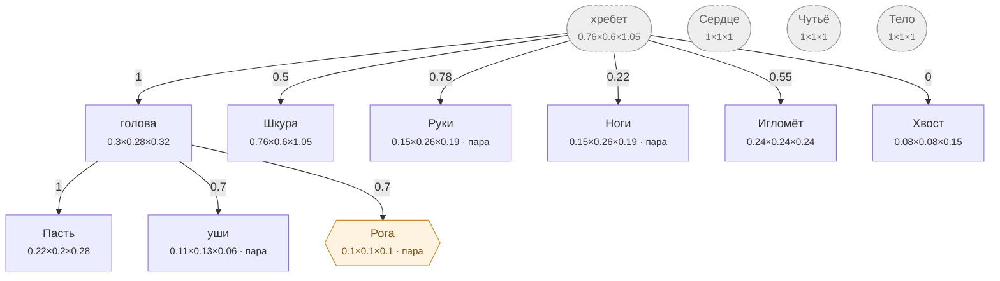

# Ёж — план тела

<!-- ВЫГРУЖЕНО из SpeciesSO командой «Chimera → Выгрузить схемы тел». Руками не править. -->

```text
хребет (внутр.)   [0.76×0.6×1.05]
├─ голова  attach 1   [0.3×0.28×0.32]
│  ├─ Пасть  attach 1   [0.22×0.2×0.28]
│  ├─ уши (пара)  attach 0.7   [0.11×0.13×0.06]
│  └─ Рога (графт) (пара)  attach 0.7   [0.1×0.1×0.1]
├─ Шкура  attach 0.5   [0.76×0.6×1.05]
├─ Руки (пара)  attach 0.78   [0.15×0.26×0.19]
├─ Ноги (пара)  attach 0.22   [0.15×0.26×0.19]
├─ Игломёт  attach 0.55   [0.24×0.24×0.24]
└─ Хвост  attach 0   [0.075×0.075×0.15]
Сердце (внутр.)   [1×1×1]
Чутьё (внутр.)   [1×1×1]
Тело (внутр.)   [1×1×1]
```



**Овал** — внутреннее место (слот есть, на теле не видно). **Гексагон** — закрытое: пустым не рисуется, проступает привитым органом. **Двойная рамка** — цепь звеньев. Цифра на стрелке — `attach`: доля вдоль длинной оси родителя.

| место | родитель | attach | калибр | своя форма | родной орган |
|---|---|---|---|---|---|
| **хребет** *(внутр.)* | — корень | — | 0.76×0.6×1.05 | — | — |
| **голова** | хребет | 1 | 0.3×0.28×0.32 | 1 част. | — |
| **Пасть** | голова | 1 | 0.22×0.2×0.28 | 4 част. | Цепкая пасть |
| **уши** | голова | 0.7 | 0.11×0.13×0.06 | 2 част. | — |
| **Шкура** | хребет | 0.5 | 0.76×0.6×1.05 | 3 част. | Иглы |
| **Руки** | хребет | 0.78 | 0.15×0.26×0.19 | 4 част. | — |
| **Ноги** | хребет | 0.22 | 0.15×0.26×0.19 | — | Ежиные ноги |
| **Игломёт** | хребет | 0.55 | 0.24×0.24×0.24 | — | Игломёт |
| **Сердце** *(внутр.)* | — корень | — | 1×1×1 | — | Ядоупорное сердце |
| **Чутьё** *(внутр.)* | — корень | — | 1×1×1 | — | Пятак |
| **Тело** *(внутр.)* | — корень | — | 1×1×1 | — | Игольчатое тело |
| **Хвост** | хребет | 0 | 0.075×0.075×0.15 | 3 част. | — |
| **Рога** *(графт)* | голова | 0.7 | 0.1×0.1×0.1 | — | — |

### Запас длинной оси

Ось выбирается по максимальной стороне `baseSize`. Мал запас — правка размера переключит ось и развернёт ветку детей (ловится только глазом).

| место с детьми | ось | запас |
|---|---|---|
| хребет | Z | 27.6% |
| голова | Z | 6.2% |
