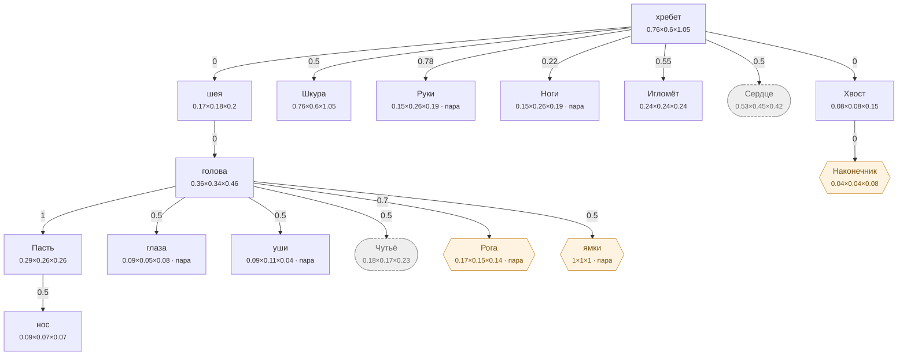

# Ёж — план тела

<!-- ВЫГРУЖЕНО из SpeciesSO командой «Chimera → Выгрузить схемы тел». Руками не править. -->

```text
хребет (форму даёт СКЕЛЕТ)   [0.76×0.6×1.05]
├─ шея (форму даёт СКЕЛЕТ)  attach 0   [0.17×0.18×0.2]
│  └─ голова (форму даёт СКЕЛЕТ)  attach 0   [0.359×0.343×0.458]
│     ├─ Пасть  attach 1   [0.287×0.26×0.258]
│     │  └─ нос  attach 0.5   [0.086×0.073×0.069]
│     ├─ глаза (пара)  attach 0.5   [0.085×0.055×0.075]
│     ├─ уши (пара)  attach 0.5   [0.09×0.11×0.04]
│     ├─ Чутьё (внутр.)  attach 0.5   [0.18×0.172×0.229]
│     ├─ Рога (графт) (пара)  attach 0.7   [0.171×0.153×0.143]
│     └─ ямки (графт) (пара)  attach 0.5   [1×1×1]
├─ Шкура  attach 0.5   [0.76×0.6×1.05]
├─ Руки (форму даёт СКЕЛЕТ) (пара)  attach 0.78   [0.15×0.26×0.19]
├─ Ноги (форму даёт СКЕЛЕТ) (пара)  attach 0.22   [0.15×0.26×0.19]
├─ Игломёт  attach 0.55   [0.24×0.24×0.24]
├─ Сердце (внутр.) (форму даёт СКЕЛЕТ)  attach 0.5   [0.532×0.45×0.42]
└─ Хвост (форму даёт СКЕЛЕТ)  attach 0   [0.075×0.075×0.15]
   └─ Наконечник (графт)  attach 0   [0.038×0.038×0.075]
```

## Скелет

Костей: **10** — скелет 10 · мышцы 0 · признаки 0 · резы 0. Оболочку строит `BoneMesher` полем, один меш на слот.

```text
хребет  (кость · хребет)  0.68 м
├─ козырёк  (кость · хребет)  0.321 м
├─ грудь  (кость · Сердце)  0.4 м
├─ шея  (кость · шея)  0.242 м
│  └─ голова  (кость · голова)  0.158 м
├─ плечо  (кость · Руки · пара)  0.352 м
│  └─ предплечье  (кость · Руки · пара)  0.204 м
├─ бедро  (кость · Ноги · пара)  0.276 м
│  └─ голень  (кость · Ноги · пара)  0.191 м
└─ хвост  (кость · Хвост)  0.13 м
```



**Овал** — внутреннее место (слот есть, на теле не видно). **Гексагон** — закрытое: пустым не рисуется, проступает привитым органом. **Двойная рамка** — цепь звеньев. Цифра на стрелке — `attach`: доля вдоль длинной оси родителя.

| место | родитель | attach | калибр | своя форма | родной орган |
|---|---|---|---|---|---|
| **хребет** | — корень | — | 0.76×0.6×1.05 | — | Хребет |
| **шея** | хребет | 0 | 0.17×0.18×0.2 | 2 част. | — |
| **голова** | шея | 0 | 0.359×0.343×0.458 | 1 част. | — |
| **нос** | Пасть | 0.5 | 0.086×0.073×0.069 | — | — |
| **Пасть** | голова | 1 | 0.287×0.26×0.258 | 3 част. | Цепкая пасть |
| **глаза** | голова | 0.5 | 0.085×0.055×0.075 | 1 част. | — |
| **уши** | голова | 0.5 | 0.09×0.11×0.04 | — | — |
| **Шкура** | хребет | 0.5 | 0.76×0.6×1.05 | 1 част. | Иглы |
| **Руки** | хребет | 0.78 | 0.15×0.26×0.19 | 4 част. | Ежиные лапы |
| **Ноги** | хребет | 0.22 | 0.15×0.26×0.19 | — | Ежиные ноги |
| **Игломёт** | хребет | 0.55 | 0.24×0.24×0.24 | — | Игломёт |
| **Сердце** *(внутр.)* | хребет | 0.5 | 0.532×0.45×0.42 | — | Ядоупорное сердце |
| **Чутьё** *(внутр.)* | голова | 0.5 | 0.18×0.172×0.229 | — | Пятак |
| **Хвост** | хребет | 0 | 0.075×0.075×0.15 | 3 част. | — |
| **Наконечник** *(графт)* | Хвост | 0 | 0.038×0.038×0.075 | — | — |
| **Рога** *(графт)* | голова | 0.7 | 0.171×0.153×0.143 | — | — |
| **ямки** *(графт)* | голова | 0.5 | 1×1×1 | — | — |

### Запас длинной оси

Ось выбирается по максимальной стороне РАЗРЕШЁННОГО размера (свой габарит либо доля родителя). Мал запас — правка размера переключит ось и развернёт ветку детей (ловится только глазом).

| место с детьми | ось | запас |
|---|---|---|
| хребет | Z | 27.6% |
| шея | Z | 9.8% |
| голова | Z | 21.6% |
| Пасть | X | 9.4% |
| Хвост | Z | 49.9% |
