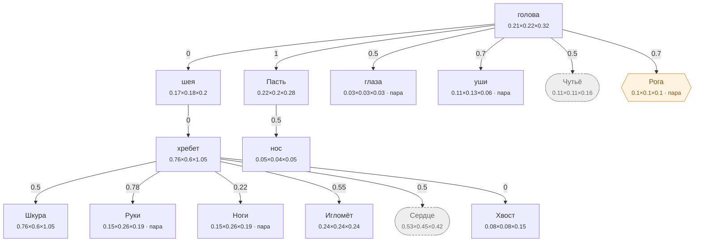

# Ёж — план тела

<!-- ВЫГРУЖЕНО из SpeciesSO командой «Chimera → Выгрузить схемы тел». Руками не править. -->

```text
голова   [0.21×0.224×0.32]
├─ шея  attach 0   [0.17×0.18×0.2]
│  └─ хребет  attach 0   [0.76×0.6×1.05]
│     ├─ Шкура  attach 0.5   [0.76×0.6×1.05]
│     ├─ Руки (пара)  attach 0.78   [0.15×0.26×0.19]
│     ├─ Ноги (пара)  attach 0.22   [0.15×0.26×0.19]
│     ├─ Игломёт  attach 0.55   [0.24×0.24×0.24]
│     ├─ Сердце (внутр.)  attach 0.5   [0.532×0.45×0.42]
│     └─ Хвост  attach 0   [0.075×0.075×0.15]
├─ Пасть  attach 1   [0.22×0.2×0.28]
│  └─ нос  attach 0.5   [0.053×0.044×0.05]
├─ глаза (пара)  attach 0.5   [0.027×0.027×0.027]
├─ уши (пара)  attach 0.7   [0.11×0.13×0.06]
├─ Чутьё (внутр.)  attach 0.5   [0.105×0.112×0.16]
└─ Рога (графт) (пара)  attach 0.7   [0.1×0.1×0.1]
```

## Скелет

Костей: **130** — скелет 85 · мышцы 42 · признаки 3 · резы 0. Оболочку строит `BoneMesher` полем, один меш на слот.

```text
грудина  (кость · Сердце)  0.109 м
├─ грудиночелюстная.м  (мышца · шея · пара)  0.181 м
├─ грудная.м  (мышца · Сердце · пара)  0.094 м
└─ прямая_живота.м  (мышца · хребет · пара)  0.194 м
лёгкие  (мышца · Сердце)  0.118 м
брюшина  (мышца · хребет)  0.142 м
череп  (кость · голова)  0.063 м
├─ затылочный  (кость · голова)  0.014 м
│  └─ шея_в  (кость · шея)  0.032 м
│     └─ шея_3  (кость · шея)  0.034 м
│        ├─ шея_2  (кость · шея)  0.034 м
│        │  └─ шея  (кость · шея)  0.036 м
│        │     └─ холка  (кость · хребет)  0.047 м
│        │        ├─ грудной  (кость · хребет)  0.081 м
│        │        │  ├─ поясница  (кость · хребет)  0.097 м
│        │        │  │  ├─ крестец  (кость · хребет)  0.033 м
│        │        │  │  │  ├─ подвздошная  (кость · Ноги · пара)  0.065 м
│        │        │  │  │  │  ├─ седалищная  (кость · Ноги · пара)  0.019 м
│        │        │  │  │  │  │  ├─ двуглавая_бедра.м  (мышца · Ноги · пара)  0.166 м
│        │        │  │  │  │  │  └─ полусухожильная.м  (мышца · Ноги · пара)  0.174 м
│        │        │  │  │  │  ├─ лобковая  (кость · Ноги · пара)  0.033 м
│        │        │  │  │  │  ├─ бедро  (кость · Ноги · пара)  0.156 м
│        │        │  │  │  │  │  ├─ голень  (кость · Ноги · пара)  0.059 м
│        │        │  │  │  │  │  │  ├─ пяточный  (кость · Ноги · пара)  0.017 м
│        │        │  │  │  │  │  │  ├─ плюсна  (кость · Ноги · пара)  0.035 м
│        │        │  │  │  │  │  │  │  ├─ лапа_з  (кость · Ноги · пара)  0.021 м
│        │        │  │  │  │  │  │  │  └─ сухожилия_з.м  (мышца · Ноги · пара)  0.038 м
│        │        │  │  │  │  │  │  └─ сгибатели_з.м  (мышца · Ноги · пара)  0.057 м
│        │        │  │  │  │  │  └─ икроножная.м  (мышца · Ноги · пара)  0.066 м
│        │        │  │  │  │  ├─ напрягатель.м  (мышца · Ноги · пара)  0.19 м
│        │        │  │  │  │  └─ четырёхглавая.м  (мышца · Ноги · пара)  0.171 м
│        │        │  │  │  ├─ хвост1  (кость · Хвост)  0.061 м
│        │        │  │  │  │  └─ хвост2  (кость · Хвост)  0.059 м
│        │        │  │  │  │     └─ хвост3  (кость · Хвост)  0.053 м
│        │        │  │  │  └─ ягодичная.м  (мышца · Ноги · пара)  0.092 м
│        │        │  │  ├─ ост_пояс1  (кость · хребет)  0.019 м
│        │        │  │  │  └─ длиннейшая.м  (мышца · хребет · пара)  0.18 м
│        │        │  │  ├─ ост_пояс2  (кость · хребет)  0.02 м
│        │        │  │  ├─ ост_пояс3  (кость · хребет)  0.019 м
│        │        │  │  ├─ ост_пояс4  (кость · хребет)  0.018 м
│        │        │  │  ├─ попереч1  (кость · хребет · пара)  0.021 м
│        │        │  │  ├─ попереч2  (кость · хребет · пара)  0.022 м
│        │        │  │  ├─ попереч3  (кость · хребет · пара)  0.021 м
│        │        │  │  └─ широчайшая.м  (мышца · хребет · пара)  0.244 м
│        │        │  ├─ остистый4  (кость · хребет)  0.038 м
│        │        │  ├─ остистый5  (кость · хребет)  0.031 м
│        │        │  ├─ остистый6  (кость · хребет)  0.025 м
│        │        │  ├─ остистый7  (кость · хребет)  0.021 м
│        │        │  ├─ ребро6  (кость · Сердце · пара)  0.119 м
│        │        │  │  └─ ребро6с  (кость · Сердце · пара)  0.157 м
│        │        │  │     ├─ ребро6н  (кость · Сердце · пара)  0.117 м
│        │        │  │     └─ межрёберная6.м  (мышца · Сердце · пара)  0.021 м
│        │        │  ├─ ребро7  (кость · Сердце · пара)  0.118 м
│        │        │  │  └─ ребро7с  (кость · Сердце · пара)  0.156 м
│        │        │  │     ├─ ребро7н  (кость · Сердце · пара)  0.118 м
│        │        │  │     └─ межрёберная7.м  (мышца · Сердце · пара)  0.021 м
│        │        │  ├─ ребро8  (кость · Сердце · пара)  0.118 м
│        │        │  │  └─ ребро8с  (кость · Сердце · пара)  0.158 м
│        │        │  │     ├─ ребро8н  (кость · Сердце · пара)  0.122 м
│        │        │  │     └─ межрёберная8.м  (мышца · Сердце · пара)  0.021 м
│        │        │  ├─ ребро9  (кость · Сердце · пара)  0.119 м
│        │        │  │  └─ ребро9с  (кость · Сердце · пара)  0.163 м
│        │        │  │     ├─ ребро9н  (кость · Сердце · пара)  0.129 м
│        │        │  │     ├─ межрёберная9.м  (мышца · Сердце · пара)  0.021 м
│        │        │  │     └─ подвздошно_рёберная.м  (мышца · хребет · пара)  0.152 м
│        │        │  ├─ ребро10  (кость · Сердце · пара)  0.122 м
│        │        │  │  └─ ребро10с  (кость · Сердце · пара)  0.17 м
│        │        │  │     ├─ ребро10н  (кость · Сердце · пара)  0.139 м
│        │        │  │     │  └─ поперечная_живота.м  (мышца · хребет · пара)  0.401 м
│        │        │  │     └─ межрёберная10.м  (мышца · Сердце · пара)  0.023 м
│        │        │  ├─ ребро11  (кость · Сердце · пара)  0.129 м
│        │        │  │  └─ ребро11с  (кость · Сердце · пара)  0.182 м
│        │        │  │     ├─ ребро11н  (кость · Сердце · пара)  0.153 м
│        │        │  │     ├─ межрёберная11.м  (мышца · Сердце · пара)  0.023 м
│        │        │  │     └─ косая_живота.м  (мышца · хребет · пара)  0.292 м
│        │        │  └─ ребро12  (кость · Сердце · пара)  0.136 м
│        │        │     └─ ребро12с  (кость · Сердце · пара)  0.196 м
│        │        │        └─ ребро12н  (кость · Сердце · пара)  0.168 м
│        │        ├─ остистый1  (кость · хребет)  0.036 м
│        │        │  ├─ выйная.м  (мышца · шея)  0.137 м
│        │        │  └─ ромбовидная.м  (мышца · хребет · пара)  0.022 м
│        │        ├─ остистый2  (кость · хребет)  0.043 м
│        │        │  └─ лопатка  (кость · Руки · пара)  0.18 м
│        │        │     ├─ плечо  (кость · Руки · пара)  0.053 м
│        │        │     │  ├─ предплечье  (кость · Руки · пара)  0.052 м
│        │        │     │  │  ├─ пясть  (кость · Руки · пара)  0.028 м
│        │        │     │  │  │  ├─ лапа_п  (кость · Руки · пара)  0.025 м
│        │        │     │  │  │  └─ сухожилия_п.м  (мышца · Руки · пара)  0.036 м
│        │        │     │  │  └─ разгибатели.м  (мышца · Руки · пара)  0.056 м
│        │        │     │  └─ локтевой_отр  (кость · Руки · пара)  0.016 м
│        │        │     ├─ дельтовидная.м  (мышца · Руки · пара)  0.065 м
│        │        │     ├─ трицепс.м  (мышца · Руки · пара)  0.15 м
│        │        │     └─ бицепс.м  (мышца · Руки · пара)  0.067 м
│        │        ├─ остистый3  (кость · хребет)  0.042 м
│        │        │  └─ трапециевидная.м  (мышца · хребет · пара)  0.084 м
│        │        ├─ ребро1  (кость · Сердце · пара)  0.14 м
│        │        │  └─ ребро1с  (кость · Сердце · пара)  0.193 м
│        │        │     ├─ ребро1н  (кость · Сердце · пара)  0.153 м
│        │        │     └─ межрёберная1.м  (мышца · Сердце · пара)  0.02 м
│        │        ├─ ребро2  (кость · Сердце · пара)  0.134 м
│        │        │  └─ ребро2с  (кость · Сердце · пара)  0.182 м
│        │        │     ├─ ребро2н  (кость · Сердце · пара)  0.142 м
│        │        │     └─ межрёберная2.м  (мышца · Сердце · пара)  0.02 м
│        │        ├─ ребро3  (кость · Сердце · пара)  0.129 м
│        │        │  └─ ребро3с  (кость · Сердце · пара)  0.172 м
│        │        │     ├─ ребро3н  (кость · Сердце · пара)  0.132 м
│        │        │     └─ межрёберная3.м  (мышца · Сердце · пара)  0.021 м
│        │        ├─ ребро4  (кость · Сердце · пара)  0.125 м
│        │        │  └─ ребро4с  (кость · Сердце · пара)  0.166 м
│        │        │     ├─ ребро4н  (кость · Сердце · пара)  0.124 м
│        │        │     ├─ зубчатая.м  (мышца · Сердце · пара)  0.209 м
│        │        │     └─ межрёберная4.м  (мышца · Сердце · пара)  0.021 м
│        │        ├─ ребро5  (кость · Сердце · пара)  0.122 м
│        │        │  └─ ребро5с  (кость · Сердце · пара)  0.16 м
│        │        │     ├─ ребро5н  (кость · Сердце · пара)  0.119 м
│        │        │     └─ межрёберная5.м  (мышца · Сердце · пара)  0.022 м
│        │        └─ пластыревидная.м  (мышца · шея · пара)  0.145 м
│        └─ плечеголовная.м  (мышца · шея · пара)  0.22 м
├─ нч_подвес  (кость · Пасть · пара)  0.053 м
│  ├─ ветвь  (кость · Пасть · пара)  0.007 м
│  │  └─ челюсть  (кость · Пасть · пара)  0.057 м
│  │     └─ клык_н  (признак · Пасть · пара)  0.015 м
│  └─ венечный  (кость · Пасть · пара)  0.014 м
├─ клык_в  (признак · Пасть · пара)  0.025 м
└─ височная.м  (мышца · голова · пара)  0.045 м
скула  (кость · голова · пара)  0.042 м
├─ скула_п  (кость · голова · пара)  0.039 м
└─ жевательная.м  (мышца · Пасть · пара)  0.031 м
глазница.р  (кость · голова · пара)  0.097 м
ухо.п  (признак · Чутьё · пара)  0.058 м
```



**Овал** — внутреннее место (слот есть, на теле не видно). **Гексагон** — закрытое: пустым не рисуется, проступает привитым органом. **Двойная рамка** — цепь звеньев. Цифра на стрелке — `attach`: доля вдоль длинной оси родителя.

| место | родитель | attach | калибр | своя форма | родной орган |
|---|---|---|---|---|---|
| **хребет** | шея | 0 | 0.76×0.6×1.05 | — | Хребет |
| **шея** | голова | 0 | 0.17×0.18×0.2 | 2 част. | — |
| **голова** | — корень | — | 0.21×0.224×0.32 | 1 част. | — |
| **нос** | Пасть | 0.5 | 0.053×0.044×0.05 | — | — |
| **Пасть** | голова | 1 | 0.22×0.2×0.28 | 3 част. | Цепкая пасть |
| **глаза** | голова | 0.5 | 0.027×0.027×0.027 | 1 част. | — |
| **уши** | голова | 0.7 | 0.11×0.13×0.06 | — | — |
| **Шкура** | хребет | 0.5 | 0.76×0.6×1.05 | 1 част. | Иглы |
| **Руки** | хребет | 0.78 | 0.15×0.26×0.19 | 4 част. | — |
| **Ноги** | хребет | 0.22 | 0.15×0.26×0.19 | — | Ежиные ноги |
| **Игломёт** | хребет | 0.55 | 0.24×0.24×0.24 | — | Игломёт |
| **Сердце** *(внутр.)* | хребет | 0.5 | 0.532×0.45×0.42 | — | Ядоупорное сердце |
| **Чутьё** *(внутр.)* | голова | 0.5 | 0.105×0.112×0.16 | — | Пятак |
| **Хвост** | хребет | 0 | 0.075×0.075×0.15 | 3 част. | — |
| **Рога** *(графт)* | голова | 0.7 | 0.1×0.1×0.1 | — | — |

### Запас длинной оси

Ось выбирается по максимальной стороне РАЗРЕШЁННОГО размера (свой габарит либо доля родителя). Мал запас — правка размера переключит ось и развернёт ветку детей (ловится только глазом).

| место с детьми | ось | запас |
|---|---|---|
| хребет | Z | 27.6% |
| шея | Z | 10% |
| голова | Z | 30% |
| Пасть | Z | 21.4% |
