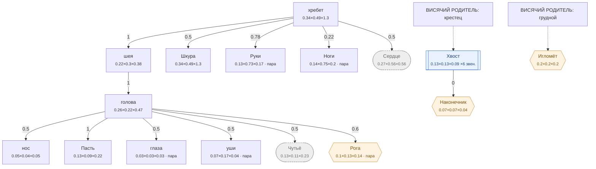

# Волк — план тела

<!-- ВЫГРУЖЕНО из SpeciesSO командой «Chimera → Выгрузить схемы тел». Руками не править. -->

```text
хребет (форму даёт СКЕЛЕТ)   [0.335×0.485×1.295]
├─ шея (форму даёт СКЕЛЕТ)  attach 1   [0.22×0.3×0.379]
│  └─ голова (форму даёт СКЕЛЕТ)  attach 1   [0.263×0.22×0.468]
│     ├─ нос (форму даёт СКЕЛЕТ)  attach 0.5   [0.047×0.036×0.047]
│     ├─ Пасть  attach 1   [0.13×0.09×0.22]
│     ├─ глаза (пара)  attach 0.5   [0.032×0.032×0.032]
│     ├─ уши (форму даёт СКЕЛЕТ) (пара)  attach 0.5   [0.075×0.165×0.035]
│     ├─ Чутьё (внутр.)  attach 0.5   [0.132×0.11×0.234]
│     └─ Рога (графт) (пара)  attach 0.6   [0.101×0.127×0.142]
├─ Шкура (форму даёт СКЕЛЕТ)  attach 0.5   [0.335×0.485×1.296]
├─ Руки (форму даёт СКЕЛЕТ) (пара)  attach 0.78   [0.128×0.725×0.17]
├─ Ноги (форму даёт СКЕЛЕТ) (пара)  attach 0.22   [0.14×0.749×0.199]
└─ Сердце (внутр.) (форму даёт СКЕЛЕТ)  attach 0.5   [0.27×0.56×0.559]
```

## Скелет

Костей: **130** — скелет 85 · мышцы 42 · признаки 3 · резы 0. Оболочку строит `BoneMesher` полем, один меш на слот.

```text
грудина  (кость · Сердце)  0.396 м
├─ грудиночелюстная.м  (мышца · шея · пара)  0.634 м
├─ грудная.м  (мышца · Сердце · пара)  0.129 м
└─ прямая_живота.м  (мышца · хребет · пара)  0.706 м
лёгкие  (мышца · Сердце)  0.43 м
брюшина  (мышца · хребет)  0.517 м
череп  (кость · голова)  0.386 м
├─ затылочный  (кость · голова)  0.086 м
│  └─ шея_в  (кость · шея)  0.114 м
│     └─ шея_3  (кость · шея)  0.126 м
│        ├─ шея_2  (кость · шея)  0.124 м
│        │  └─ шея  (кость · шея)  0.13 м
│        │     └─ холка  (кость · хребет)  0.176 м
│        │        ├─ грудной  (кость · хребет)  0.296 м
│        │        │  ├─ поясница  (кость · хребет)  0.356 м
│        │        │  │  ├─ крестец  (кость · хребет)  0.121 м
│        │        │  │  │  ├─ подвздошная  (кость · Ноги · пара)  0.236 м
│        │        │  │  │  │  ├─ седалищная  (кость · Ноги · пара)  0.07 м
│        │        │  │  │  │  │  ├─ двуглавая_бедра.м  (мышца · Ноги · пара)  0.384 м
│        │        │  │  │  │  │  └─ полусухожильная.м  (мышца · Ноги · пара)  0.423 м
│        │        │  │  │  │  ├─ лобковая  (кость · Ноги · пара)  0.12 м
│        │        │  │  │  │  ├─ бедро  (кость · Ноги · пара)  0.328 м
│        │        │  │  │  │  │  ├─ голень  (кость · Ноги · пара)  0.309 м
│        │        │  │  │  │  │  │  ├─ пяточный  (кость · Ноги · пара)  0.061 м
│        │        │  │  │  │  │  │  ├─ плюсна  (кость · Ноги · пара)  0.231 м
│        │        │  │  │  │  │  │  │  ├─ лапа_з  (кость · Ноги · пара)  0.096 м
│        │        │  │  │  │  │  │  │  └─ сухожилия_з.м  (мышца · Ноги · пара)  0.249 м
│        │        │  │  │  │  │  │  └─ сгибатели_з.м  (мышца · Ноги · пара)  0.317 м
│        │        │  │  │  │  │  └─ икроножная.м  (мышца · Ноги · пара)  0.312 м
│        │        │  │  │  │  ├─ напрягатель.м  (мышца · Ноги · пара)  0.439 м
│        │        │  │  │  │  └─ четырёхглавая.м  (мышца · Ноги · пара)  0.371 м
│        │        │  │  │  ├─ хвост1  (кость · Хвост)  0.224 м
│        │        │  │  │  │  └─ хвост2  (кость · Хвост)  0.213 м
│        │        │  │  │  │     └─ хвост3  (кость · Хвост)  0.192 м
│        │        │  │  │  └─ ягодичная.м  (мышца · Ноги · пара)  0.266 м
│        │        │  │  ├─ ост_пояс1  (кость · хребет)  0.068 м
│        │        │  │  │  └─ длиннейшая.м  (мышца · хребет · пара)  0.661 м
│        │        │  │  ├─ ост_пояс2  (кость · хребет)  0.072 м
│        │        │  │  ├─ ост_пояс3  (кость · хребет)  0.07 м
│        │        │  │  ├─ ост_пояс4  (кость · хребет)  0.066 м
│        │        │  │  ├─ попереч1  (кость · хребет · пара)  0.069 м
│        │        │  │  ├─ попереч2  (кость · хребет · пара)  0.073 м
│        │        │  │  ├─ попереч3  (кость · хребет · пара)  0.069 м
│        │        │  │  └─ широчайшая.м  (мышца · хребет · пара)  0.689 м
│        │        │  ├─ остистый4  (кость · хребет)  0.138 м
│        │        │  ├─ остистый5  (кость · хребет)  0.115 м
│        │        │  ├─ остистый6  (кость · хребет)  0.091 м
│        │        │  ├─ остистый7  (кость · хребет)  0.077 м
│        │        │  ├─ ребро6  (кость · Сердце · пара)  0.131 м
│        │        │  │  └─ ребро6с  (кость · Сердце · пара)  0.16 м
│        │        │  │     ├─ ребро6н  (кость · Сердце · пара)  0.144 м
│        │        │  │     └─ межрёберная6.м  (мышца · Сердце · пара)  0.042 м
│        │        │  ├─ ребро7  (кость · Сердце · пара)  0.135 м
│        │        │  │  └─ ребро7с  (кость · Сердце · пара)  0.163 м
│        │        │  │     ├─ ребро7н  (кость · Сердце · пара)  0.146 м
│        │        │  │     └─ межрёберная7.м  (мышца · Сердце · пара)  0.042 м
│        │        │  ├─ ребро8  (кость · Сердце · пара)  0.136 м
│        │        │  │  └─ ребро8с  (кость · Сердце · пара)  0.165 м
│        │        │  │     ├─ ребро8н  (кость · Сердце · пара)  0.145 м
│        │        │  │     └─ межрёберная8.м  (мышца · Сердце · пара)  0.042 м
│        │        │  ├─ ребро9  (кость · Сердце · пара)  0.134 м
│        │        │  │  └─ ребро9с  (кость · Сердце · пара)  0.164 м
│        │        │  │     ├─ ребро9н  (кость · Сердце · пара)  0.141 м
│        │        │  │     ├─ межрёберная9.м  (мышца · Сердце · пара)  0.042 м
│        │        │  │     └─ подвздошно_рёберная.м  (мышца · хребет · пара)  0.326 м
│        │        │  ├─ ребро10  (кость · Сердце · пара)  0.131 м
│        │        │  │  └─ ребро10с  (кость · Сердце · пара)  0.161 м
│        │        │  │     ├─ ребро10н  (кость · Сердце · пара)  0.134 м
│        │        │  │     │  └─ поперечная_живота.м  (мышца · хребет · пара)  0.691 м
│        │        │  │     └─ межрёберная10.м  (мышца · Сердце · пара)  0.043 м
│        │        │  ├─ ребро11  (кость · Сердце · пара)  0.124 м
│        │        │  │  └─ ребро11с  (кость · Сердце · пара)  0.152 м
│        │        │  │     ├─ ребро11н  (кость · Сердце · пара)  0.122 м
│        │        │  │     ├─ межрёберная11.м  (мышца · Сердце · пара)  0.043 м
│        │        │  │     └─ косая_живота.м  (мышца · хребет · пара)  0.582 м
│        │        │  └─ ребро12  (кость · Сердце · пара)  0.116 м
│        │        │     └─ ребро12с  (кость · Сердце · пара)  0.143 м
│        │        │        └─ ребро12н  (кость · Сердце · пара)  0.111 м
│        │        ├─ остистый1  (кость · хребет)  0.131 м
│        │        │  ├─ выйная.м  (мышца · шея)  0.517 м
│        │        │  └─ ромбовидная.м  (мышца · хребет · пара)  0.051 м
│        │        ├─ остистый2  (кость · хребет)  0.157 м
│        │        │  └─ лопатка  (кость · Руки · пара)  0.315 м
│        │        │     ├─ плечо  (кость · Руки · пара)  0.275 м
│        │        │     │  ├─ предплечье  (кость · Руки · пара)  0.314 м
│        │        │     │  │  ├─ пясть  (кость · Руки · пара)  0.182 м
│        │        │     │  │  │  ├─ лапа_п  (кость · Руки · пара)  0.13 м
│        │        │     │  │  │  └─ сухожилия_п.м  (мышца · Руки · пара)  0.223 м
│        │        │     │  │  └─ разгибатели.м  (мышца · Руки · пара)  0.344 м
│        │        │     │  └─ локтевой_отр  (кость · Руки · пара)  0.058 м
│        │        │     ├─ дельтовидная.м  (мышца · Руки · пара)  0.181 м
│        │        │     ├─ трицепс.м  (мышца · Руки · пара)  0.373 м
│        │        │     └─ бицепс.м  (мышца · Руки · пара)  0.349 м
│        │        ├─ остистый3  (кость · хребет)  0.154 м
│        │        │  └─ трапециевидная.м  (мышца · хребет · пара)  0.203 м
│        │        ├─ ребро1  (кость · Сердце · пара)  0.094 м
│        │        │  └─ ребро1с  (кость · Сердце · пара)  0.123 м
│        │        │     ├─ ребро1н  (кость · Сердце · пара)  0.106 м
│        │        │     └─ межрёберная1.м  (мышца · Сердце · пара)  0.036 м
│        │        ├─ ребро2  (кость · Сердце · пара)  0.104 м
│        │        │  └─ ребро2с  (кость · Сердце · пара)  0.133 м
│        │        │     ├─ ребро2н  (кость · Сердце · пара)  0.115 м
│        │        │     └─ межрёберная2.м  (мышца · Сердце · пара)  0.036 м
│        │        ├─ ребро3  (кость · Сердце · пара)  0.113 м
│        │        │  └─ ребро3с  (кость · Сердце · пара)  0.142 м
│        │        │     ├─ ребро3н  (кость · Сердце · пара)  0.124 м
│        │        │     └─ межрёберная3.м  (мышца · Сердце · пара)  0.039 м
│        │        ├─ ребро4  (кость · Сердце · пара)  0.12 м
│        │        │  └─ ребро4с  (кость · Сердце · пара)  0.148 м
│        │        │     ├─ ребро4н  (кость · Сердце · пара)  0.132 м
│        │        │     ├─ зубчатая.м  (мышца · Сердце · пара)  0.199 м
│        │        │     └─ межрёберная4.м  (мышца · Сердце · пара)  0.04 м
│        │        ├─ ребро5  (кость · Сердце · пара)  0.126 м
│        │        │  └─ ребро5с  (кость · Сердце · пара)  0.155 м
│        │        │     ├─ ребро5н  (кость · Сердце · пара)  0.139 м
│        │        │     └─ межрёберная5.м  (мышца · Сердце · пара)  0.043 м
│        │        └─ пластыревидная.м  (мышца · шея · пара)  0.535 м
│        └─ плечеголовная.м  (мышца · шея · пара)  0.521 м
├─ нч_подвес  (кость · Пасть · пара)  0.082 м
│  ├─ ветвь  (кость · Пасть · пара)  0.045 м
│  │  └─ челюсть  (кость · Пасть · пара)  0.293 м
│  │     └─ клык_н  (признак · Пасть · пара)  0.056 м
│  └─ венечный  (кость · Пасть · пара)  0.071 м
├─ клык_в  (признак · Пасть · пара)  0.09 м
└─ височная.м  (мышца · голова · пара)  0.046 м
скула  (кость · голова · пара)  0.083 м
├─ скула_п  (кость · голова · пара)  0.104 м
└─ жевательная.м  (мышца · Пасть · пара)  0.073 м
глазница.р  (кость · голова · пара)  0.099 м
ухо.п  (признак · Чутьё · пара)  0.16 м
```



**Овал** — внутреннее место (слот есть, на теле не видно). **Гексагон** — закрытое: пустым не рисуется, проступает привитым органом. **Двойная рамка** — цепь звеньев. Цифра на стрелке — `attach`: доля вдоль длинной оси родителя.

| место | родитель | attach | калибр | своя форма | родной орган |
|---|---|---|---|---|---|
| **хребет** | — корень | — | 0.335×0.485×1.295 | — | Хребет |
| **нос** | голова | 0.5 | 0.047×0.036×0.047 | — | — |
| **голова** | шея | 1 | 0.263×0.22×0.468 | 12 част. | — |
| **Пасть** | голова | 1 | 0.13×0.09×0.22 | — | Пасть |
| **глаза** | голова | 0.5 | 0.032×0.032×0.032 | 1 част. | — |
| **уши** | голова | 0.5 | 0.075×0.165×0.035 | — | — |
| **шея** | хребет | 1 | 0.22×0.3×0.379 | 2 част. | — |
| **Шкура** | хребет | 0.5 | 0.335×0.485×1.296 | 1 част. | Шкура |
| **Руки** | хребет | 0.78 | 0.128×0.725×0.17 | — | Коготь |
| **Ноги** | хребет | 0.22 | 0.14×0.749×0.199 | — | Волчьи ноги |
| **Хвост** | крестец | 1 | 0.13×0.13×0.088 | — | — |
| **Сердце** *(внутр.)* | хребет | 0.5 | 0.27×0.56×0.559 | — | Волчье сердце |
| **Чутьё** *(внутр.)* | голова | 0.5 | 0.132×0.11×0.234 | — | Нюх |
| **Рога** *(графт)* | голова | 0.6 | 0.101×0.127×0.142 | — | — |
| **Наконечник** *(графт)* | Хвост | 0 | 0.065×0.065×0.044 | — | — |
| **Игломёт** *(графт)* | грудной | 0.5 | 0.198×0.198×0.198 | — | — |

### Запас длинной оси

Ось выбирается по максимальной стороне РАЗРЕШЁННОГО размера (свой габарит либо доля родителя). Мал запас — правка размера переключит ось и развернёт ветку детей (ловится только глазом).

| место с детьми | ось | запас |
|---|---|---|
| хребет | Z | 62.5% |
| голова | Z | 43.8% |
| шея | Z | 20.9% |
| Хвост | Y | 0% ⚠️ хрупко |
