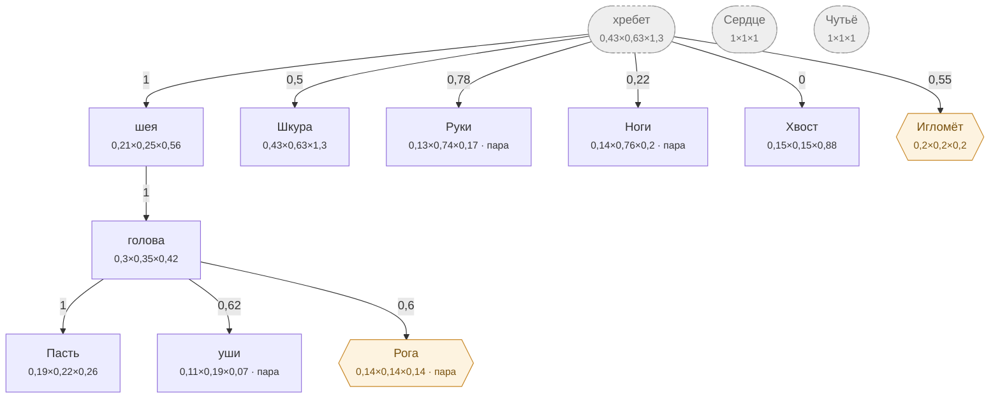

# Волк — план тела

<!-- ВЫГРУЖЕНО из SpeciesSO командой «Chimera → Выгрузить схемы тел». Руками не править. -->

```text
хребет (внутр.)   [0,427×0,625×1,295]
├─ шея  attach 1   [0,205×0,25×0,56]
│  └─ голова  attach 1   [0,3×0,345×0,42]
│     ├─ Пасть  attach 1   [0,19×0,215×0,26]
│     ├─ уши (пара)  attach 0,62   [0,11×0,185×0,07]
│     └─ Рога (графт) (пара)  attach 0,6   [0,137×0,137×0,137]
├─ Шкура  attach 0,5   [0,427×0,625×1,296]
├─ Руки (пара)  attach 0,78   [0,128×0,74×0,17]
├─ Ноги (пара)  attach 0,22   [0,14×0,76×0,2]
├─ Хвост  attach 0   [0,15×0,15×0,88]
└─ Игломёт (графт)  attach 0,55   [0,198×0,198×0,198]
Сердце (внутр.)   [1×1×1]
Чутьё (внутр.)   [1×1×1]
```



**Овал** — внутреннее место (слот есть, на теле не видно). **Гексагон** — закрытое: пустым не рисуется, проступает привитым органом. **Двойная рамка** — цепь звеньев. Цифра на стрелке — `attach`: доля вдоль длинной оси родителя.

| место | родитель | attach | калибр | своя форма | родной орган |
|---|---|---|---|---|---|
| **хребет** *(внутр.)* | — корень | — | 0,427×0,625×1,295 | — | — |
| **голова** | шея | 1 | 0,3×0,345×0,42 | 4 част. | — |
| **Пасть** | голова | 1 | 0,19×0,215×0,26 | 5 част. | Пасть |
| **уши** | голова | 0,62 | 0,11×0,185×0,07 | 3 част. | — |
| **шея** | хребет | 1 | 0,205×0,25×0,56 | 2 част. | — |
| **Шкура** | хребет | 0,5 | 0,427×0,625×1,296 | 8 част. | Шкура |
| **Руки** | хребет | 0,78 | 0,128×0,74×0,17 | — | Коготь |
| **Ноги** | хребет | 0,22 | 0,14×0,76×0,2 | — | Волчьи ноги |
| **Хвост** | хребет | 0 | 0,15×0,15×0,88 | 5 част. | — |
| **Сердце** *(внутр.)* | — корень | — | 1×1×1 | — | Волчье сердце |
| **Чутьё** *(внутр.)* | — корень | — | 1×1×1 | — | Нюх |
| **Рога** *(графт)* | голова | 0,6 | 0,137×0,137×0,137 | — | — |
| **Игломёт** *(графт)* | хребет | 0,55 | 0,198×0,198×0,198 | — | — |

### Запас длинной оси

Ось выбирается по максимальной стороне `baseSize`. Мал запас — правка размера переключит ось и развернёт ветку детей (ловится только глазом).

| место с детьми | ось | запас |
|---|---|---|
| хребет | Z | 51,7% |
| голова | Z | 17,9% |
| шея | Z | 55,4% |
