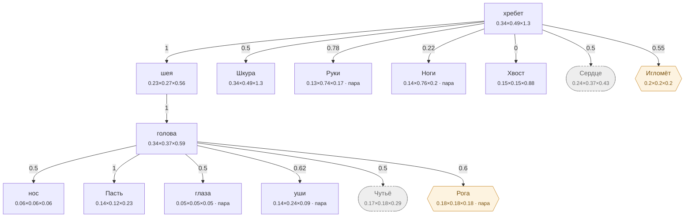

# Волк — план тела

<!-- ВЫГРУЖЕНО из SpeciesSO командой «Chimera → Выгрузить схемы тел». Руками не править. -->

```text
хребет   [0.335×0.485×1.295]
├─ шея  attach 1   [0.232×0.268×0.559]
│  └─ голова  attach 1   [0.336×0.366×0.589]
│     ├─ нос  attach 0.5   [0.06×0.059×0.059]
│     ├─ Пасть  attach 1   [0.143×0.117×0.234]
│     ├─ глаза (пара)  attach 0.5   [0.047×0.047×0.046]
│     ├─ уши (пара)  attach 0.62   [0.143×0.241×0.091]
│     ├─ Чутьё (внутр.)  attach 0.5   [0.168×0.183×0.294]
│     └─ Рога (графт) (пара)  attach 0.6   [0.178×0.179×0.178]
├─ Шкура  attach 0.5   [0.335×0.485×1.296]
├─ Руки (пара)  attach 0.78   [0.128×0.74×0.17]
├─ Ноги (пара)  attach 0.22   [0.14×0.76×0.199]
├─ Хвост  attach 0   [0.15×0.15×0.881]
├─ Сердце (внутр.)  attach 0.5   [0.241×0.369×0.427]
└─ Игломёт (графт)  attach 0.55   [0.198×0.198×0.198]
```



**Овал** — внутреннее место (слот есть, на теле не видно). **Гексагон** — закрытое: пустым не рисуется, проступает привитым органом. **Двойная рамка** — цепь звеньев. Цифра на стрелке — `attach`: доля вдоль длинной оси родителя.

| место | родитель | attach | калибр | своя форма | родной орган |
|---|---|---|---|---|---|
| **хребет** | — корень | — | 0.335×0.485×1.295 | — | Хребет |
| **нос** | голова | 0.5 | 0.06×0.059×0.059 | — | — |
| **голова** | шея | 1 | 0.336×0.366×0.589 | 5 част. | — |
| **Пасть** | голова | 1 | 0.143×0.117×0.234 | 1 част. | Пасть |
| **глаза** | голова | 0.5 | 0.047×0.047×0.046 | 1 част. | — |
| **уши** | голова | 0.62 | 0.143×0.241×0.091 | — | — |
| **шея** | хребет | 1 | 0.232×0.268×0.559 | 2 част. | — |
| **Шкура** | хребет | 0.5 | 0.335×0.485×1.296 | 1 част. | Шкура |
| **Руки** | хребет | 0.78 | 0.128×0.74×0.17 | — | Коготь |
| **Ноги** | хребет | 0.22 | 0.14×0.76×0.199 | — | Волчьи ноги |
| **Хвост** | хребет | 0 | 0.15×0.15×0.881 | 5 част. | — |
| **Сердце** *(внутр.)* | хребет | 0.5 | 0.241×0.369×0.427 | — | Волчье сердце |
| **Чутьё** *(внутр.)* | голова | 0.5 | 0.168×0.183×0.294 | — | Нюх |
| **Рога** *(графт)* | голова | 0.6 | 0.178×0.179×0.178 | — | — |
| **Игломёт** *(графт)* | хребет | 0.55 | 0.198×0.198×0.198 | — | — |

### Запас длинной оси

Ось выбирается по максимальной стороне РАЗРЕШЁННОГО размера (свой габарит либо доля родителя). Мал запас — правка размера переключит ось и развернёт ветку детей (ловится только глазом).

| место с детьми | ось | запас |
|---|---|---|
| хребет | Z | 62.5% |
| голова | Z | 37.8% |
| шея | Z | 52.1% |
