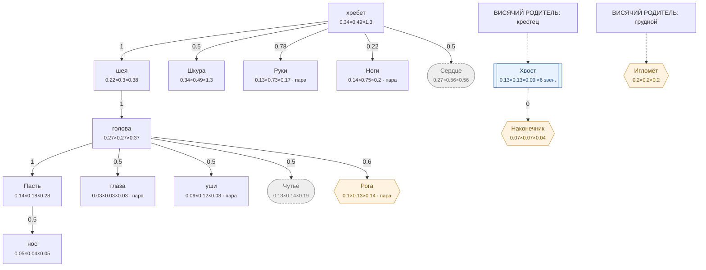

# Волк — план тела

<!-- ВЫГРУЖЕНО из SpeciesSO командой «Chimera → Выгрузить схемы тел». Руками не править. -->

```text
хребет (форму даёт СКЕЛЕТ)   [0.335×0.485×1.295]
├─ шея (форму даёт СКЕЛЕТ)  attach 1   [0.22×0.3×0.379]
│  └─ голова (форму даёт СКЕЛЕТ)  attach 1   [0.266×0.27×0.375]
│     ├─ Пасть  attach 1   [0.14×0.18×0.28]
│     │  └─ нос  attach 0.5   [0.047×0.04×0.045]
│     ├─ глаза (пара)  attach 0.5   [0.032×0.032×0.032]
│     ├─ уши (пара)  attach 0.5   [0.085×0.12×0.035]
│     ├─ Чутьё (внутр.)  attach 0.5   [0.133×0.135×0.187]
│     └─ Рога (графт) (пара)  attach 0.6   [0.101×0.127×0.142]
├─ Шкура (форму даёт СКЕЛЕТ)  attach 0.5   [0.335×0.485×1.296]
├─ Руки (форму даёт СКЕЛЕТ) (пара)  attach 0.78   [0.128×0.725×0.17]
├─ Ноги (форму даёт СКЕЛЕТ) (пара)  attach 0.22   [0.14×0.749×0.199]
└─ Сердце (внутр.) (форму даёт СКЕЛЕТ)  attach 0.5   [0.27×0.56×0.559]
```

## Скелет

Костей: **16** — скелет 16 · мышцы 0 · признаки 0 · резы 0. Оболочку строит `BoneMesher` полем, один меш на слот.

```text
хребет  (кость · хребет)  0.9 м
├─ крестец  (кость · хребет)  0.304 м
│  ├─ бедро  (кость · Ноги · пара)  0.256 м
│  │  ├─ ляжка  (кость · Ноги · пара)  0.183 м
│  │  └─ голень  (кость · Ноги · пара)  0.288 м
│  └─ хвост  (кость · Хвост)  0.367 м
│     └─ хвост_кисть  (кость · Хвост)  0.335 м
└─ грудной  (кость · хребет)  0.401 м
   ├─ грудь  (кость · Сердце)  0.501 м
   ├─ шея  (кость · шея)  0.44 м
   │  ├─ голова  (кость · голова)  0.17 м
   │  └─ грива  (кость · шея)  0.379 м
   ├─ загривок  (кость · хребет)  0.423 м
   └─ лопатка  (кость · Руки · пара)  0.257 м
      └─ плечо  (кость · Руки · пара)  0.187 м
         └─ предплечье  (кость · Руки · пара)  0.161 м
```



**Овал** — внутреннее место (слот есть, на теле не видно). **Гексагон** — закрытое: пустым не рисуется, проступает привитым органом. **Двойная рамка** — цепь звеньев. Цифра на стрелке — `attach`: доля вдоль длинной оси родителя.

| место | родитель | attach | калибр | своя форма | родной орган |
|---|---|---|---|---|---|
| **хребет** | — корень | — | 0.335×0.485×1.295 | — | Хребет |
| **нос** | Пасть | 0.5 | 0.047×0.04×0.045 | — | — |
| **голова** | шея | 1 | 0.266×0.27×0.375 | 12 част. | — |
| **Пасть** | голова | 1 | 0.14×0.18×0.28 | — | Пасть |
| **глаза** | голова | 0.5 | 0.032×0.032×0.032 | 1 част. | — |
| **уши** | голова | 0.5 | 0.085×0.12×0.035 | — | — |
| **шея** | хребет | 1 | 0.22×0.3×0.379 | 2 част. | — |
| **Шкура** | хребет | 0.5 | 0.335×0.485×1.296 | 1 част. | Шкура |
| **Руки** | хребет | 0.78 | 0.128×0.725×0.17 | — | Коготь |
| **Ноги** | хребет | 0.22 | 0.14×0.749×0.199 | — | Волчьи ноги |
| **Хвост** | крестец | 1 | 0.13×0.13×0.088 | — | — |
| **Сердце** *(внутр.)* | хребет | 0.5 | 0.27×0.56×0.559 | — | Волчье сердце |
| **Чутьё** *(внутр.)* | голова | 0.5 | 0.133×0.135×0.187 | — | Нюх |
| **Рога** *(графт)* | голова | 0.6 | 0.101×0.127×0.142 | — | — |
| **Наконечник** *(графт)* | Хвост | 0 | 0.065×0.065×0.044 | — | — |
| **Игломёт** *(графт)* | грудной | 0.5 | 0.198×0.198×0.198 | — | — |

### Запас длинной оси

Ось выбирается по максимальной стороне РАЗРЕШЁННОГО размера (свой габарит либо доля родителя). Мал запас — правка размера переключит ось и развернёт ветку детей (ловится только глазом).

| место с детьми | ось | запас |
|---|---|---|
| хребет | Z | 62.5% |
| голова | Z | 27.9% |
| Пасть | Z | 35.6% |
| шея | Z | 20.9% |
| Хвост | Y | 0% ⚠️ хрупко |
