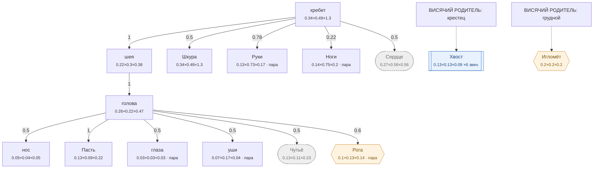

# Волк — план тела

<!-- ВЫГРУЖЕНО из SpeciesSO командой «Chimera → Выгрузить схемы тел». Руками не править. -->

```text
хребет (форму даёт СКЕЛЕТ)   [0.335×0.485×1.295]
├─ шея (форму даёт СКЕЛЕТ)  attach 1   [0.22×0.3×0.379]
│  └─ голова (форму даёт СКЕЛЕТ)  attach 1   [0.263×0.22×0.468]
│     ├─ нос (форму даёт СКЕЛЕТ)  attach 0.5   [0.047×0.036×0.047]
│     ├─ Пасть  attach 1   [0.13×0.09×0.22]
│     ├─ глаза (пара)  attach 0.5   [0.032×0.032×0.032]
│     ├─ уши (форму даёт СКЕЛЕТ) (пара)  attach 0.5   [0.075×0.165×0.035]
│     ├─ Чутьё (внутр.)  attach 0.5   [0.132×0.11×0.234]
│     └─ Рога (графт) (пара)  attach 0.6   [0.101×0.127×0.142]
├─ Шкура (форму даёт СКЕЛЕТ)  attach 0.5   [0.335×0.485×1.296]
├─ Руки (форму даёт СКЕЛЕТ) (пара)  attach 0.78   [0.128×0.725×0.17]
├─ Ноги (форму даёт СКЕЛЕТ) (пара)  attach 0.22   [0.14×0.749×0.199]
└─ Сердце (внутр.) (форму даёт СКЕЛЕТ)  attach 0.5   [0.27×0.56×0.559]
```

## Скелет

Костей: **81** — скелет 44 · мышцы 24 · признаки 11 · резы 2. Оболочку строит `BoneMesher` полем, один меш на слот.

```text
крестец  (кость · хребет)  0.181 м
├─ поясница  (кость · хребет)  0.401 м
│  ├─ грудной  (кость · хребет)  0.4 м
│  │  ├─ шея  (кость · шея)  0.383 м
│  │  │  ├─ коробка  (кость · голова)  0.18 м
│  │  │  │  ├─ ростр  (кость · голова)  0.183 м
│  │  │  │  │  ├─ мочка.п  (признак · Чутьё)  0.025 м
│  │  │  │  │  └─ ноздря.р  (рез · Чутьё · пара)  0.021 м → мочка.п
│  │  │  │  ├─ гребень  (кость · голова)  0.057 м
│  │  │  │  ├─ скула  (кость · голова · пара)  0.122 м
│  │  │  │  │  └─ жевательная.м  (мышца · голова · пара)  0.077 м → челюсть
│  │  │  │  ├─ ветвь  (кость · Пасть · пара)  0.126 м
│  │  │  │  │  └─ челюсть  (кость · Пасть · пара)  0.267 м
│  │  │  │  │     └─ рот.р  (рез · Пасть · пара)  0.232 м → ростр
│  │  │  │  ├─ ухо.п  (признак · Чутьё · пара)  0.19 м
│  │  │  │  └─ надбровье.п  (признак · голова · пара)  0.06 м
│  │  │  ├─ горловая.м  (мышца · шея)  0.397 м → ветвь
│  │  │  ├─ плечеголовная.м  (мышца · Руки · пара)  0.463 м → плечо
│  │  │  ├─ трапециевидная.м  (мышца · хребет · пара)  0.306 м → лопатка
│  │  │  └─ ромбовидная.м  (мышца · хребет · пара)  0.243 м → лопатка
│  │  ├─ ребро1  (кость · Сердце · пара)  0.107 м
│  │  │  └─ ребро1с  (кость · Сердце · пара)  0.141 м
│  │  │     └─ ребро1н  (кость · Сердце · пара)  0.074 м
│  │  │        └─ брюшная.м  (мышца · хребет · пара)  0.497 м → таз
│  │  ├─ ребро2  (кость · Сердце · пара)  0.104 м
│  │  │  └─ ребро2с  (кость · Сердце · пара)  0.141 м
│  │  │     ├─ ребро2н  (кость · Сердце · пара)  0.114 м
│  │  │     └─ косая_живота.м  (мышца · хребет · пара)  0.573 м → таз
│  │  ├─ ребро3  (кость · Сердце · пара)  0.101 м
│  │  │  └─ ребро3с  (кость · Сердце · пара)  0.141 м
│  │  │     ├─ ребро3н  (кость · Сердце · пара)  0.137 м
│  │  │     └─ зубчатая.м  (мышца · Сердце · пара)  0.146 м → лопатка
│  │  ├─ ребро4  (кость · Сердце · пара)  0.098 м
│  │  │  ├─ ребро4с  (кость · Сердце · пара)  0.141 м
│  │  │  │  ├─ ребро4н  (кость · Сердце · пара)  0.142 м
│  │  │  │  └─ межрёберная.м  (мышца · Сердце · пара)  0.236 м → ребро1с
│  │  │  └─ лопатка  (кость · Руки · пара)  0.304 м
│  │  │     ├─ плечо  (кость · Руки · пара)  0.316 м
│  │  │     │  └─ предплечье  (кость · Руки · пара)  0.317 м
│  │  │     │     ├─ пясть  (кость · Руки · пара)  0.201 м
│  │  │     │     │  └─ лапа  (кость · Руки · пара)  0.061 м
│  │  │     │     └─ сгибатели.м  (мышца · Руки · пара)  0.325 м → пясть
│  │  │     ├─ трицепс.м  (мышца · Руки · пара)  0.404 м → предплечье
│  │  │     ├─ дельтовидная.м  (мышца · Руки · пара)  0.188 м → плечо
│  │  │     └─ бицепс.м  (мышца · Руки · пара)  0.37 м → предплечье
│  │  ├─ ребро5  (кость · Сердце · пара)  0.096 м
│  │  │  ├─ ребро5с  (кость · Сердце · пара)  0.141 м
│  │  │  │  └─ ребро5н  (кость · Сердце · пара)  0.118 м
│  │  │  └─ длиннейшая_гр.м  (мышца · хребет · пара)  0.316 м → ребро1
│  │  ├─ грудина  (кость · Сердце)  0.283 м
│  │  │  ├─ грудная.м  (мышца · Сердце · пара)  0.204 м → плечо
│  │  │  └─ грудиночелюстная.м  (мышца · шея · пара)  0.369 м → ветвь
│  │  └─ пластыревидная.м  (мышца · шея · пара)  0.438 м → коробка
│  ├─ отросток1  (кость · хребет · пара)  0.141 м
│  │  └─ длиннейшая.м  (мышца · хребет · пара)  0.329 м → отросток4
│  ├─ отросток2  (кость · хребет · пара)  0.149 м
│  ├─ отросток3  (кость · хребет · пара)  0.149 м
│  ├─ отросток4  (кость · хребет · пара)  0.141 м
│  └─ широчайшая.м  (мышца · хребет · пара)  0.458 м → лопатка
├─ хвост1  (кость · Хвост)  0.159 м
│  └─ хвост2  (кость · Хвост)  0.159 м
│     └─ хвост3  (кость · Хвост)  0.16 м
│        └─ хвост4  (кость · Хвост)  0.159 м
├─ таз  (кость · Ноги · пара)  0.28 м
│  ├─ бедро  (кость · Ноги · пара)  0.319 м
│  │  ├─ голень  (кость · Ноги · пара)  0.35 м
│  │  │  └─ плюсна  (кость · Ноги · пара)  0.221 м
│  │  │     └─ лапа_з  (кость · Ноги · пара)  0.054 м
│  │  └─ икроножная.м  (мышца · Ноги · пара)  0.391 м → плюсна
│  └─ четырёхглавая.м  (мышца · Ноги · пара)  0.367 м → голень
├─ ягодичная.м  (мышца · Ноги · пара)  0.302 м → бедро
├─ двуглавая.м  (мышца · Ноги · пара)  0.593 м → голень
└─ полусухожильная.м  (мышца · Ноги · пара)  0.63 м → голень
височная.п  (признак · голова · пара)  0.08 м
дуга.п  (признак · голова · пара)  0.065 м
лоб_площадка.п  (признак · голова · пара)  0.053 м
спинка_носа.п  (признак · голова)  0.159 м
вибриссы.п  (признак · Чутьё · пара)  0.071 м
губа_верх.п  (признак · Пасть · пара)  0.087 м
подбородок_м.п  (признак · Пасть)  0.041 м
затылок_бугор.п  (признак · голова)  0.047 м
```



**Овал** — внутреннее место (слот есть, на теле не видно). **Гексагон** — закрытое: пустым не рисуется, проступает привитым органом. **Двойная рамка** — цепь звеньев. Цифра на стрелке — `attach`: доля вдоль длинной оси родителя.

| место | родитель | attach | калибр | своя форма | родной орган |
|---|---|---|---|---|---|
| **хребет** | — корень | — | 0.335×0.485×1.295 | — | Хребет |
| **нос** | голова | 0.5 | 0.047×0.036×0.047 | — | — |
| **голова** | шея | 1 | 0.263×0.22×0.468 | 12 част. | — |
| **Пасть** | голова | 1 | 0.13×0.09×0.22 | — | Пасть |
| **глаза** | голова | 0.5 | 0.032×0.032×0.032 | 1 част. | — |
| **уши** | голова | 0.5 | 0.075×0.165×0.035 | — | — |
| **шея** | хребет | 1 | 0.22×0.3×0.379 | 2 част. | — |
| **Шкура** | хребет | 0.5 | 0.335×0.485×1.296 | 1 част. | Шкура |
| **Руки** | хребет | 0.78 | 0.128×0.725×0.17 | — | Коготь |
| **Ноги** | хребет | 0.22 | 0.14×0.749×0.199 | — | Волчьи ноги |
| **Хвост** | крестец | 0 | 0.13×0.13×0.088 | — | — |
| **Сердце** *(внутр.)* | хребет | 0.5 | 0.27×0.56×0.559 | — | Волчье сердце |
| **Чутьё** *(внутр.)* | голова | 0.5 | 0.132×0.11×0.234 | — | Нюх |
| **Рога** *(графт)* | голова | 0.6 | 0.101×0.127×0.142 | — | — |
| **Игломёт** *(графт)* | грудной | 0.5 | 0.198×0.198×0.198 | — | — |

### Запас длинной оси

Ось выбирается по максимальной стороне РАЗРЕШЁННОГО размера (свой габарит либо доля родителя). Мал запас — правка размера переключит ось и развернёт ветку детей (ловится только глазом).

| место с детьми | ось | запас |
|---|---|---|
| хребет | Z | 62.5% |
| голова | Z | 43.8% |
| шея | Z | 20.9% |
