# Змея — план тела

<!-- ВЫГРУЖЕНО из SpeciesSO командой «Chimera → Выгрузить схемы тел». Руками не править. -->

```text
Пасть (внутр.)   [1×1×1]
Шкура (внутр.)   [1×1×1]
Тело (внутр.)   [1×1×1]
Хвост (внутр.)   [1×1×1]
Сердце (внутр.)   [1×1×1]
Чутьё (внутр.)   [1×1×1]
Руки (графт) (пара)   [0.1×0.34×0.1]
Ноги (графт) (пара)   [0.1×0.34×0.1]
Рога (графт) (пара)   [0.09×0.09×0.09]
Игломёт (графт)   [0.13×0.13×0.13]
```

```mermaid
flowchart TD
    n0(["Пасть<br/><small>1×1×1</small>"])
    n1(["Шкура<br/><small>1×1×1</small>"])
    n2(["Тело<br/><small>1×1×1</small>"])
    n3(["Хвост<br/><small>1×1×1</small>"])
    n4(["Сердце<br/><small>1×1×1</small>"])
    n5(["Чутьё<br/><small>1×1×1</small>"])
    n6{{"Руки<br/><small>0.1×0.34×0.1 · пара</small>"}}
    n7{{"Ноги<br/><small>0.1×0.34×0.1 · пара</small>"}}
    n8{{"Рога<br/><small>0.09×0.09×0.09 · пара</small>"}}
    n9{{"Игломёт<br/><small>0.13×0.13×0.13</small>"}}


    classDef hid fill:#eee,stroke:#999,stroke-dasharray:4 3,color:#666
    classDef gr fill:#fdf3e0,stroke:#c98a2b,color:#7a5310
    classDef ch fill:#e8f2ff,stroke:#3b74c4,color:#1c3f70
    class n0,n1,n2,n3,n4,n5 hid
    class n6,n7,n8,n9 gr
```



**Овал** — внутреннее место (слот есть, на теле не видно). **Гексагон** — закрытое: пустым не рисуется, проступает привитым органом. **Двойная рамка** — цепь звеньев. Цифра на стрелке — `attach`: доля вдоль длинной оси родителя.

| место | родитель | attach | калибр | своя форма | родной орган |
|---|---|---|---|---|---|
| **Пасть** *(внутр.)* | — корень | — | 1×1×1 | — | Ядовитые клыки |
| **Шкура** *(внутр.)* | — корень | — | 1×1×1 | — | Чешуя |
| **Тело** *(внутр.)* | — корень | — | 1×1×1 | — | Тело-хвост |
| **Хвост** *(внутр.)* | — корень | — | 1×1×1 | — | Хвост |
| **Сердце** *(внутр.)* | — корень | — | 1×1×1 | — | Хладнокровное сердце |
| **Чутьё** *(внутр.)* | — корень | — | 1×1×1 | — | Пит-орган |
| **Руки** *(графт)* | — корень | — | 0.1×0.34×0.1 | — | — |
| **Ноги** *(графт)* | — корень | — | 0.1×0.34×0.1 | — | — |
| **Рога** *(графт)* | — корень | — | 0.09×0.09×0.09 | — | — |
| **Игломёт** *(графт)* | — корень | — | 0.13×0.13×0.13 | — | — |

### Запас длинной оси

Ось выбирается по максимальной стороне `baseSize`. Мал запас — правка размера переключит ось и развернёт ветку детей (ловится только глазом).

| место с детьми | ось | запас |
|---|---|---|
