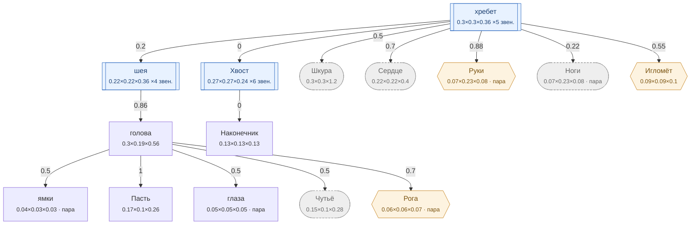

# Змея — план тела

<!-- ВЫГРУЖЕНО из SpeciesSO командой «Chimera → Выгрузить схемы тел». Руками не править. -->

```text
хребет ×5 звен.   [0.3×0.3×0.36]
├─ шея ×4 звен.  attach 0.2   [0.215×0.215×0.36]
│  └─ голова (форму даёт СКЕЛЕТ)  attach 0.86   [0.3×0.19×0.56]
│     ├─ ямки (пара)  attach 0.5   [0.035×0.03×0.03]
│     ├─ Пасть  attach 1   [0.165×0.105×0.26]
│     ├─ глаза (пара)  attach 0.5   [0.05×0.05×0.05]
│     ├─ Чутьё (внутр.)  attach 0.5   [0.15×0.095×0.28]
│     └─ Рога (графт) (пара)  attach 0.7   [0.061×0.061×0.072]
├─ Хвост ×6 звен.  attach 0   [0.266×0.266×0.24]
│  └─ Наконечник  attach 0   [0.13×0.13×0.13]
├─ Шкура (внутр.)  attach 0.5   [0.3×0.3×1.2]
├─ Сердце (внутр.)  attach 0.7   [0.22×0.22×0.4]
├─ Руки (графт) (пара)  attach 0.88   [0.068×0.231×0.08]
├─ Ноги (внутр.) (пара)  attach 0.22   [0.068×0.231×0.08]
└─ Игломёт (графт)  attach 0.55   [0.088×0.088×0.104]
```

## Скелет

Костей: **1** — скелет 1 · мышцы 0 · признаки 0 · резы 0. Оболочку строит `BoneMesher` полем, один меш на слот.

```text
голова  (кость · голова)  0.27 м
```



**Овал** — внутреннее место (слот есть, на теле не видно). **Гексагон** — закрытое: пустым не рисуется, проступает привитым органом. **Двойная рамка** — цепь звеньев. Цифра на стрелке — `attach`: доля вдоль длинной оси родителя.

| место | родитель | attach | калибр | своя форма | родной орган |
|---|---|---|---|---|---|
| **ямки** | голова | 0.5 | 0.035×0.03×0.03 | — | — |
| **голова** | шея | 0.86 | 0.3×0.19×0.56 | 8 част. | — |
| **Пасть** | голова | 1 | 0.165×0.105×0.26 | 1 част. | Ядовитые клыки |
| **глаза** | голова | 0.5 | 0.05×0.05×0.05 | 1 част. | — |
| **шея** | хребет | 0.2 | 0.215×0.215×0.36 | — | — |
| **хребет** | — корень | — | 0.3×0.3×0.36 | — | — |
| **Хвост** | хребет | 0 | 0.266×0.266×0.24 | — | Хвост |
| **Наконечник** | Хвост | 0 | 0.13×0.13×0.13 | — | Погремушка |
| **Шкура** *(внутр.)* | хребет | 0.5 | 0.3×0.3×1.2 | — | Чешуя |
| **Сердце** *(внутр.)* | хребет | 0.7 | 0.22×0.22×0.4 | — | Хладнокровное сердце |
| **Чутьё** *(внутр.)* | голова | 0.5 | 0.15×0.095×0.28 | — | Пит-орган |
| **Руки** *(графт)* | хребет | 0.88 | 0.068×0.231×0.08 | — | — |
| **Ноги** *(внутр.)* | хребет | 0.22 | 0.068×0.231×0.08 | — | Тело-хвост |
| **Рога** *(графт)* | голова | 0.7 | 0.061×0.061×0.072 | — | — |
| **Игломёт** *(графт)* | хребет | 0.55 | 0.088×0.088×0.104 | — | — |

### Запас длинной оси

Ось выбирается по максимальной стороне РАЗРЕШЁННОГО размера (свой габарит либо доля родителя). Мал запас — правка размера переключит ось и развернёт ветку детей (ловится только глазом).

| место с детьми | ось | запас |
|---|---|---|
| голова | Z | 46.4% |
| шея | Z | 40.3% |
| хребет | Z | 16.7% |
| Хвост | Y | 0% ⚠️ хрупко |
