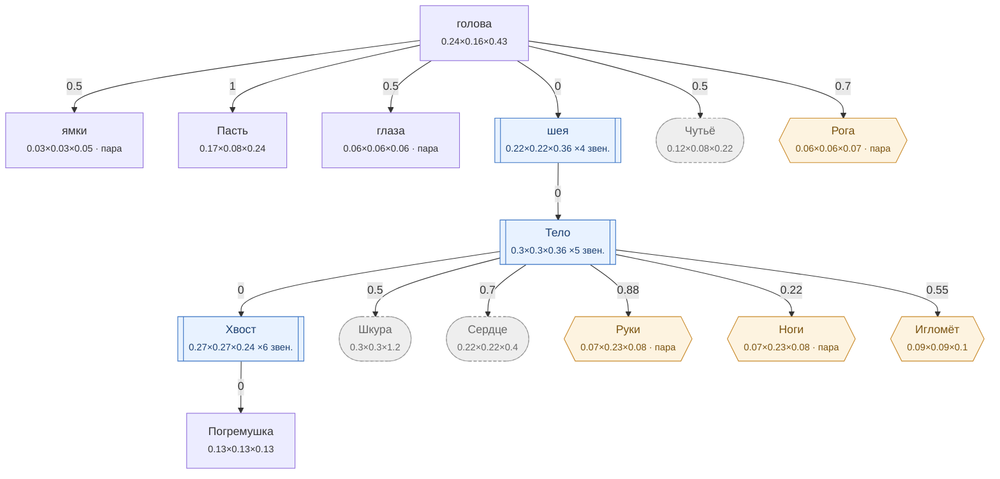

# Змея — план тела

<!-- ВЫГРУЖЕНО из SpeciesSO командой «Chimera → Выгрузить схемы тел». Руками не править. -->

```text
голова   [0.24×0.163×0.43]
├─ ямки (пара)  attach 0.5   [0.034×0.026×0.052]
├─ Пасть  attach 1   [0.17×0.08×0.24]
├─ глаза (пара)  attach 0.5   [0.056×0.056×0.056]
├─ шея ×4 звен.  attach 0   [0.215×0.215×0.36]
│  └─ Тело ×5 звен.  attach 0   [0.3×0.3×0.36]
│     ├─ Хвост ×6 звен.  attach 0   [0.266×0.266×0.24]
│     │  └─ Погремушка  attach 0   [0.13×0.13×0.13]
│     ├─ Шкура (внутр.)  attach 0.5   [0.3×0.3×1.2]
│     ├─ Сердце (внутр.)  attach 0.7   [0.22×0.22×0.4]
│     ├─ Руки (графт) (пара)  attach 0.88   [0.068×0.231×0.08]
│     ├─ Ноги (графт) (пара)  attach 0.22   [0.068×0.231×0.08]
│     └─ Игломёт (графт)  attach 0.55   [0.088×0.088×0.104]
├─ Чутьё (внутр.)  attach 0.5   [0.12×0.082×0.215]
└─ Рога (графт) (пара)  attach 0.7   [0.061×0.061×0.072]
```



**Овал** — внутреннее место (слот есть, на теле не видно). **Гексагон** — закрытое: пустым не рисуется, проступает привитым органом. **Двойная рамка** — цепь звеньев. Цифра на стрелке — `attach`: доля вдоль длинной оси родителя.

| место | родитель | attach | калибр | своя форма | родной орган |
|---|---|---|---|---|---|
| **ямки** | голова | 0.5 | 0.034×0.026×0.052 | — | — |
| **голова** | — корень | — | 0.24×0.163×0.43 | 8 част. | — |
| **Пасть** | голова | 1 | 0.17×0.08×0.24 | 1 част. | Ядовитые клыки |
| **глаза** | голова | 0.5 | 0.056×0.056×0.056 | 1 част. | — |
| **шея** | голова | 0 | 0.215×0.215×0.36 | — | — |
| **Тело** | шея | 0 | 0.3×0.3×0.36 | — | Тело-хвост |
| **Хвост** | Тело | 0 | 0.266×0.266×0.24 | — | Хвост |
| **Погремушка** | Хвост | 0 | 0.13×0.13×0.13 | — | Погремушка |
| **Шкура** *(внутр.)* | Тело | 0.5 | 0.3×0.3×1.2 | — | Чешуя |
| **Сердце** *(внутр.)* | Тело | 0.7 | 0.22×0.22×0.4 | — | Хладнокровное сердце |
| **Чутьё** *(внутр.)* | голова | 0.5 | 0.12×0.082×0.215 | — | Пит-орган |
| **Руки** *(графт)* | Тело | 0.88 | 0.068×0.231×0.08 | — | — |
| **Ноги** *(графт)* | Тело | 0.22 | 0.068×0.231×0.08 | — | — |
| **Рога** *(графт)* | голова | 0.7 | 0.061×0.061×0.072 | — | — |
| **Игломёт** *(графт)* | Тело | 0.55 | 0.088×0.088×0.104 | — | — |

### Запас длинной оси

Ось выбирается по максимальной стороне РАЗРЕШЁННОГО размера (свой габарит либо доля родителя). Мал запас — правка размера переключит ось и развернёт ветку детей (ловится только глазом).

| место с детьми | ось | запас |
|---|---|---|
| голова | Z | 44.2% |
| шея | Z | 40.3% |
| Тело | Z | 16.5% |
| Хвост | Y | 0% ⚠️ хрупко |
