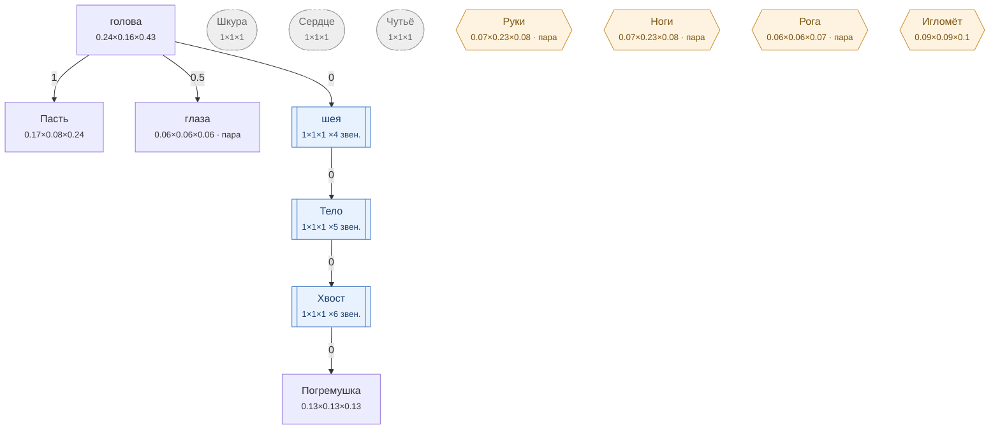

# Змея — план тела

<!-- ВЫГРУЖЕНО из SpeciesSO командой «Chimera → Выгрузить схемы тел». Руками не править. -->

```text
голова   [0.24×0.163×0.43]
├─ Пасть  attach 1   [0.17×0.08×0.24]
├─ глаза (пара)  attach 0.5   [0.056×0.056×0.056]
└─ шея ×4 звен.  attach 0   [1×1×1]
   └─ Тело ×5 звен.  attach 0   [1×1×1]
      └─ Хвост ×6 звен.  attach 0   [1×1×1]
         └─ Погремушка  attach 0   [0.13×0.13×0.13]
Шкура (внутр.)   [1×1×1]
Сердце (внутр.)   [1×1×1]
Чутьё (внутр.)   [1×1×1]
Руки (графт) (пара)   [0.068×0.231×0.08]
Ноги (графт) (пара)   [0.068×0.231×0.08]
Рога (графт) (пара)   [0.061×0.061×0.072]
Игломёт (графт)   [0.088×0.088×0.104]
```



**Овал** — внутреннее место (слот есть, на теле не видно). **Гексагон** — закрытое: пустым не рисуется, проступает привитым органом. **Двойная рамка** — цепь звеньев. Цифра на стрелке — `attach`: доля вдоль длинной оси родителя.

| место | родитель | attach | калибр | своя форма | родной орган |
|---|---|---|---|---|---|
| **голова** | — корень | — | 0.24×0.163×0.43 | 10 част. | — |
| **Пасть** | голова | 1 | 0.17×0.08×0.24 | 1 част. | Ядовитые клыки |
| **глаза** | голова | 0.5 | 0.056×0.056×0.056 | 1 част. | — |
| **шея** | голова | 0 | 1×1×1 | — | — |
| **Тело** | шея | 0 | 1×1×1 | — | Тело-хвост |
| **Хвост** | Тело | 0 | 1×1×1 | — | Хвост |
| **Погремушка** | Хвост | 0 | 0.13×0.13×0.13 | — | Погремушка |
| **Шкура** *(внутр.)* | — корень | — | 1×1×1 | — | Чешуя |
| **Сердце** *(внутр.)* | — корень | — | 1×1×1 | — | Хладнокровное сердце |
| **Чутьё** *(внутр.)* | — корень | — | 1×1×1 | — | Пит-орган |
| **Руки** *(графт)* | — корень | — | 0.068×0.231×0.08 | — | — |
| **Ноги** *(графт)* | — корень | — | 0.068×0.231×0.08 | — | — |
| **Рога** *(графт)* | — корень | — | 0.061×0.061×0.072 | — | — |
| **Игломёт** *(графт)* | — корень | — | 0.088×0.088×0.104 | — | — |

### Запас длинной оси

Ось выбирается по максимальной стороне `baseSize`. Мал запас — правка размера переключит ось и развернёт ветку детей (ловится только глазом).

| место с детьми | ось | запас |
|---|---|---|
| голова | Z | 44.2% |
| шея | Z | 0% ⚠️ хрупко |
| Тело | Z | 0% ⚠️ хрупко |
| Хвост | Z | 0% ⚠️ хрупко |
