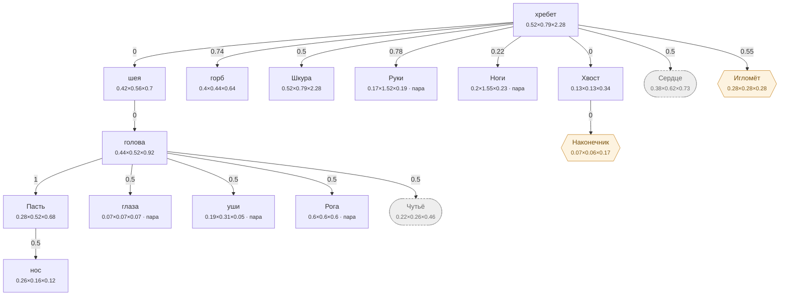

# Лось — план тела

<!-- ВЫГРУЖЕНО из SpeciesSO командой «Chimera → Выгрузить схемы тел». Руками не править. -->

```text
хребет (форму даёт СКЕЛЕТ)   [0.521×0.791×2.284]
├─ шея (форму даёт СКЕЛЕТ)  attach 0   [0.419×0.56×0.699]
│  └─ голова (форму даёт СКЕЛЕТ)  attach 0   [0.442×0.516×0.92]
│     ├─ Пасть  attach 1   [0.278×0.519×0.684]
│     │  └─ нос  attach 0.5   [0.255×0.16×0.12]
│     ├─ глаза (пара)  attach 0.5   [0.07×0.07×0.07]
│     ├─ уши (пара)  attach 0.5   [0.185×0.308×0.05]
│     ├─ Рога (пара)  attach 0.5   [0.6×0.6×0.6]
│     └─ Чутьё (внутр.)  attach 0.5   [0.221×0.258×0.46]
├─ горб (форму даёт СКЕЛЕТ)  attach 0.74   [0.396×0.443×0.64]
├─ Шкура (форму даёт СКЕЛЕТ)  attach 0.5   [0.521×0.791×2.284]
├─ Руки (форму даёт СКЕЛЕТ) (пара)  attach 0.78   [0.17×1.52×0.194]
├─ Ноги (форму даёт СКЕЛЕТ) (пара)  attach 0.22   [0.205×1.55×0.228]
├─ Хвост (форму даёт СКЕЛЕТ)  attach 0   [0.13×0.13×0.34]
│  └─ Наконечник (графт)  attach 0   [0.065×0.065×0.17]
├─ Сердце (внутр.) (форму даёт СКЕЛЕТ)  attach 0.5   [0.375×0.617×0.731]
└─ Игломёт (графт)  attach 0.55   [0.281×0.281×0.281]
```

## Скелет

Костей: **17** — скелет 17 · мышцы 0 · признаки 0 · резы 0. Оболочку строит `BoneMesher` полем, один меш на слот.

```text
хребет  (кость · хребет)  1.45 м
├─ крестец  (кость · хребет)  0.306 м
│  ├─ бедро  (кость · Ноги · пара)  0.737 м
│  │  ├─ ляжка  (кость · Ноги · пара)  0.624 м
│  │  └─ голень  (кость · Ноги · пара)  0.404 м
│  └─ хвост  (кость · Хвост)  0.262 м
└─ грудной  (кость · хребет)  0.826 м
   ├─ горб  (кость · горб)  0.776 м
   │  └─ грива  (кость · горб)  0.856 м
   ├─ грудь  (кость · Сердце)  1.402 м
   ├─ шея  (кость · шея)  0.85 м
   │  ├─ голова  (кость · голова)  0.22 м
   │  │  └─ переносье  (кость · голова)  0.2 м
   │  └─ серьга  (кость · шея)  0.405 м
   └─ лопатка  (кость · Руки · пара)  0.769 м
      └─ плечо  (кость · Руки · пара)  0.713 м
         └─ предплечье  (кость · Руки · пара)  0.629 м
```



**Овал** — внутреннее место (слот есть, на теле не видно). **Гексагон** — закрытое: пустым не рисуется, проступает привитым органом. **Двойная рамка** — цепь звеньев. Цифра на стрелке — `attach`: доля вдоль длинной оси родителя.

| место | родитель | attach | калибр | своя форма | родной орган |
|---|---|---|---|---|---|
| **хребет** | — корень | — | 0.521×0.791×2.284 | — | Хребет |
| **нос** | Пасть | 0.5 | 0.255×0.16×0.12 | — | — |
| **голова** | шея | 0 | 0.442×0.516×0.92 | 5 част. | — |
| **Пасть** | голова | 1 | 0.278×0.519×0.684 | 1 част. | Глотка |
| **глаза** | голова | 0.5 | 0.07×0.07×0.07 | 1 част. | — |
| **уши** | голова | 0.5 | 0.185×0.308×0.05 | — | — |
| **шея** | хребет | 0 | 0.419×0.56×0.699 | 2 част. | — |
| **горб** | хребет | 0.74 | 0.396×0.443×0.64 | 4 част. | — |
| **Шкура** | хребет | 0.5 | 0.521×0.791×2.284 | 1 част. | Толстая шкура |
| **Руки** | хребет | 0.78 | 0.17×1.52×0.194 | — | Копыто |
| **Ноги** | хребет | 0.22 | 0.205×1.55×0.228 | — | Лосиные ноги |
| **Хвост** | хребет | 0 | 0.13×0.13×0.34 | 4 част. | — |
| **Рога** | голова | 0.5 | 0.6×0.6×0.6 | — | Рога |
| **Сердце** *(внутр.)* | хребет | 0.5 | 0.375×0.617×0.731 | — | Лосиное сердце |
| **Чутьё** *(внутр.)* | голова | 0.5 | 0.221×0.258×0.46 | — | Слух |
| **Наконечник** *(графт)* | Хвост | 0 | 0.065×0.065×0.17 | — | — |
| **Игломёт** *(графт)* | хребет | 0.55 | 0.281×0.281×0.281 | — | — |

### Запас длинной оси

Ось выбирается по максимальной стороне РАЗРЕШЁННОГО размера (свой габарит либо доля родителя). Мал запас — правка размера переключит ось и развернёт ветку детей (ловится только глазом).

| место с детьми | ось | запас |
|---|---|---|
| хребет | Z | 65.4% |
| голова | Z | 43.9% |
| Пасть | Z | 24.1% |
| шея | Z | 19.9% |
| Хвост | Z | 61.7% |
