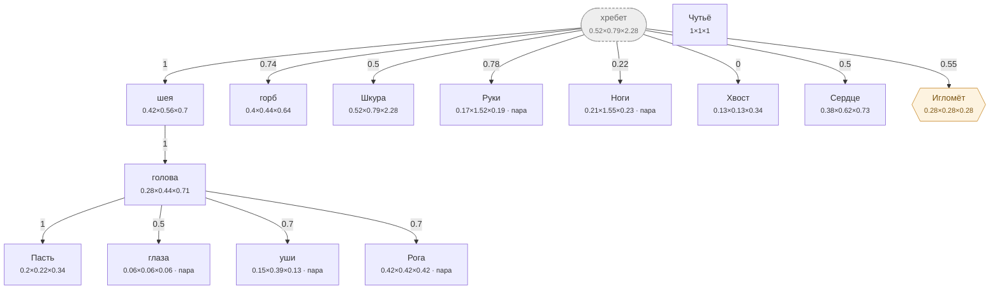

# Лось — план тела

<!-- ВЫГРУЖЕНО из SpeciesSO командой «Chimera → Выгрузить схемы тел». Руками не править. -->

```text
хребет (внутр.)   [0.521×0.791×2.284]
├─ шея  attach 1   [0.42×0.56×0.7]
│  └─ голова  attach 1   [0.284×0.442×0.711]
│     ├─ Пасть  attach 1   [0.195×0.221×0.337]
│     ├─ глаза (пара)  attach 0.5   [0.058×0.058×0.058]
│     ├─ уши (пара)  attach 0.7   [0.149×0.39×0.129]
│     └─ Рога (пара)  attach 0.7   [0.415×0.416×0.416]
├─ горб  attach 0.74   [0.396×0.443×0.64]
├─ Шкура  attach 0.5   [0.521×0.791×2.284]
├─ Руки (пара)  attach 0.78   [0.17×1.52×0.193]
├─ Ноги (пара)  attach 0.22   [0.205×1.55×0.228]
├─ Хвост  attach 0   [0.13×0.13×0.34]
├─ Сердце  attach 0.5   [0.375×0.617×0.731]
└─ Игломёт (графт)  attach 0.55   [0.281×0.281×0.281]
Чутьё   [1×1×1]
```



**Овал** — внутреннее место (слот есть, на теле не видно). **Гексагон** — закрытое: пустым не рисуется, проступает привитым органом. **Двойная рамка** — цепь звеньев. Цифра на стрелке — `attach`: доля вдоль длинной оси родителя.

| место | родитель | attach | калибр | своя форма | родной орган |
|---|---|---|---|---|---|
| **хребет** *(внутр.)* | — корень | — | 0.521×0.791×2.284 | — | — |
| **голова** | шея | 1 | 0.284×0.442×0.711 | 6 част. | — |
| **Пасть** | голова | 1 | 0.195×0.221×0.337 | 1 част. | Глотка |
| **глаза** | голова | 0.5 | 0.058×0.058×0.058 | 1 част. | — |
| **уши** | голова | 0.7 | 0.149×0.39×0.129 | 2 част. | — |
| **шея** | хребет | 1 | 0.42×0.56×0.7 | 2 част. | — |
| **горб** | хребет | 0.74 | 0.396×0.443×0.64 | 4 част. | — |
| **Шкура** | хребет | 0.5 | 0.521×0.791×2.284 | 6 част. | Толстая шкура |
| **Руки** | хребет | 0.78 | 0.17×1.52×0.193 | — | Копыто |
| **Ноги** | хребет | 0.22 | 0.205×1.55×0.228 | — | Лосиные ноги |
| **Хвост** | хребет | 0 | 0.13×0.13×0.34 | 4 част. | — |
| **Рога** | голова | 0.7 | 0.415×0.416×0.416 | — | Рога |
| **Сердце** | хребет | 0.5 | 0.375×0.617×0.731 | — | Лосиное сердце |
| **Чутьё** | — корень | — | 1×1×1 | — | Слух |
| **Игломёт** *(графт)* | хребет | 0.55 | 0.281×0.281×0.281 | — | — |

### Запас длинной оси

Ось выбирается по максимальной стороне `baseSize`. Мал запас — правка размера переключит ось и развернёт ветку детей (ловится только глазом).

| место с детьми | ось | запас |
|---|---|---|
| хребет | Z | 65.4% |
| голова | Z | 37.8% |
| шея | Z | 20% |
