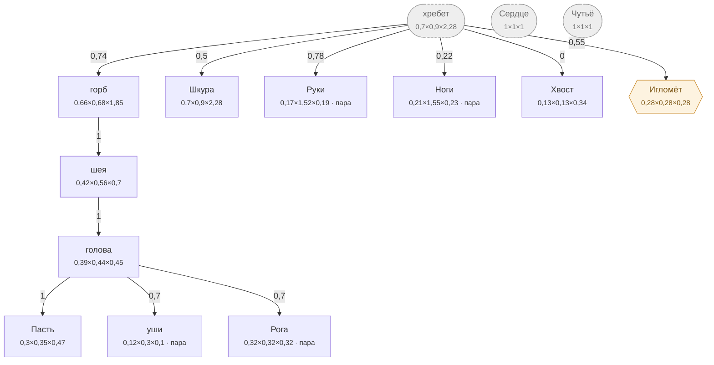

# Лось — план тела

<!-- ВЫГРУЖЕНО из SpeciesSO командой «Chimera → Выгрузить схемы тел». Руками не править. -->

```text
хребет (внутр.)   [0,703×0,9×2,284]
├─ горб  attach 0,74   [0,66×0,68×1,85]
│  └─ шея  attach 1   [0,42×0,56×0,7]
│     └─ голова  attach 1   [0,39×0,44×0,45]
│        ├─ Пасть  attach 1   [0,3×0,35×0,47]
│        ├─ уши (пара)  attach 0,7   [0,115×0,3×0,1]
│        └─ Рога (пара)  attach 0,7   [0,32×0,32×0,32]
├─ Шкура  attach 0,5   [0,703×0,9×2,284]
├─ Руки (пара)  attach 0,78   [0,17×1,52×0,193]
├─ Ноги (пара)  attach 0,22   [0,205×1,55×0,228]
├─ Хвост  attach 0   [0,13×0,13×0,34]
└─ Игломёт (графт)  attach 0,55   [0,281×0,281×0,281]
Сердце (внутр.)   [1×1×1]
Чутьё (внутр.)   [1×1×1]
```



**Овал** — внутреннее место (слот есть, на теле не видно). **Гексагон** — закрытое: пустым не рисуется, проступает привитым органом. **Двойная рамка** — цепь звеньев. Цифра на стрелке — `attach`: доля вдоль длинной оси родителя.

| место | родитель | attach | калибр | своя форма | родной орган |
|---|---|---|---|---|---|
| **хребет** *(внутр.)* | — корень | — | 0,703×0,9×2,284 | — | — |
| **голова** | шея | 1 | 0,39×0,44×0,45 | 2 част. | — |
| **Пасть** | голова | 1 | 0,3×0,35×0,47 | 6 част. | Глотка |
| **уши** | голова | 0,7 | 0,115×0,3×0,1 | 2 част. | — |
| **шея** | горб | 1 | 0,42×0,56×0,7 | 2 част. | — |
| **горб** | хребет | 0,74 | 0,66×0,68×1,85 | 4 част. | — |
| **Шкура** | хребет | 0,5 | 0,703×0,9×2,284 | 7 част. | Толстая шкура |
| **Руки** | хребет | 0,78 | 0,17×1,52×0,193 | — | Копыто |
| **Ноги** | хребет | 0,22 | 0,205×1,55×0,228 | — | Лосиные ноги |
| **Хвост** | хребет | 0 | 0,13×0,13×0,34 | 4 част. | — |
| **Рога** | голова | 0,7 | 0,32×0,32×0,32 | — | Рога |
| **Сердце** *(внутр.)* | — корень | — | 1×1×1 | — | Лосиное сердце |
| **Чутьё** *(внутр.)* | — корень | — | 1×1×1 | — | Слух |
| **Игломёт** *(графт)* | хребет | 0,55 | 0,281×0,281×0,281 | — | — |

### Запас длинной оси

Ось выбирается по максимальной стороне `baseSize`. Мал запас — правка размера переключит ось и развернёт ветку детей (ловится только глазом).

| место с детьми | ось | запас |
|---|---|---|
| хребет | Z | 60,6% |
| голова | Z | 2,2% ⚠️ хрупко |
| шея | Z | 20% |
| горб | Z | 63,2% |
