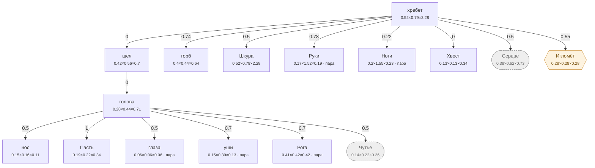

# Лось — план тела

<!-- ВЫГРУЖЕНО из SpeciesSO командой «Chimera → Выгрузить схемы тел». Руками не править. -->

```text
хребет   [0.521×0.791×2.284]
├─ шея  attach 0   [0.419×0.56×0.699]
│  └─ голова  attach 0   [0.284×0.442×0.711]
│     ├─ нос  attach 0.5   [0.153×0.159×0.114]
│     ├─ Пасть  attach 1   [0.194×0.221×0.337]
│     ├─ глаза (пара)  attach 0.5   [0.058×0.058×0.058]
│     ├─ уши (пара)  attach 0.7   [0.149×0.39×0.129]
│     ├─ Рога (пара)  attach 0.7   [0.415×0.416×0.416]
│     └─ Чутьё (внутр.)  attach 0.5   [0.142×0.221×0.356]
├─ горб  attach 0.74   [0.396×0.443×0.64]
├─ Шкура  attach 0.5   [0.521×0.791×2.284]
├─ Руки (пара)  attach 0.78   [0.17×1.52×0.194]
├─ Ноги (пара)  attach 0.22   [0.205×1.55×0.228]
├─ Хвост  attach 0   [0.13×0.13×0.34]
├─ Сердце (внутр.)  attach 0.5   [0.375×0.617×0.731]
└─ Игломёт (графт)  attach 0.55   [0.281×0.281×0.281]
```

## Скелет

Костей: **130** — скелет 85 · мышцы 42 · признаки 3 · резы 0. Оболочку строит `BoneMesher` полем, один меш на слот.

```text
грудина  (кость · Сердце)  0.708 м
├─ грудиночелюстная.м  (мышца · шея · пара)  1.173 м
├─ грудная.м  (мышца · Сердце · пара)  0.21 м
└─ прямая_живота.м  (мышца · хребет · пара)  1.242 м
лёгкие  (мышца · Сердце)  0.754 м
брюшина  (мышца · хребет)  0.907 м
череп  (кость · голова)  0.574 м
├─ затылочный  (кость · голова)  0.128 м
│  └─ шея_в  (кость · шея)  0.22 м
│     └─ шея_3  (кость · шея)  0.232 м
│        ├─ шея_2  (кость · шея)  0.222 м
│        │  └─ шея  (кость · шея)  0.23 м
│        │     └─ холка  (кость · хребет)  0.308 м
│        │        ├─ грудной  (кость · хребет)  0.519 м
│        │        │  ├─ поясница  (кость · хребет)  0.624 м
│        │        │  │  ├─ крестец  (кость · хребет)  0.211 м
│        │        │  │  │  ├─ подвздошная  (кость · Ноги · пара)  0.428 м
│        │        │  │  │  │  ├─ седалищная  (кость · Ноги · пара)  0.128 м
│        │        │  │  │  │  │  ├─ двуглавая_бедра.м  (мышца · Ноги · пара)  0.746 м
│        │        │  │  │  │  │  └─ полусухожильная.м  (мышца · Ноги · пара)  0.825 м
│        │        │  │  │  │  ├─ лобковая  (кость · Ноги · пара)  0.189 м
│        │        │  │  │  │  ├─ бедро  (кость · Ноги · пара)  0.625 м
│        │        │  │  │  │  │  ├─ голень  (кость · Ноги · пара)  0.595 м
│        │        │  │  │  │  │  │  ├─ пяточный  (кость · Ноги · пара)  0.121 м
│        │        │  │  │  │  │  │  ├─ плюсна  (кость · Ноги · пара)  0.457 м
│        │        │  │  │  │  │  │  │  ├─ лапа_з  (кость · Ноги · пара)  0.177 м
│        │        │  │  │  │  │  │  │  └─ сухожилия_з.м  (мышца · Ноги · пара)  0.492 м
│        │        │  │  │  │  │  │  └─ сгибатели_з.м  (мышца · Ноги · пара)  0.615 м
│        │        │  │  │  │  │  └─ икроножная.м  (мышца · Ноги · пара)  0.602 м
│        │        │  │  │  │  ├─ напрягатель.м  (мышца · Ноги · пара)  0.86 м
│        │        │  │  │  │  └─ четырёхглавая.м  (мышца · Ноги · пара)  0.722 м
│        │        │  │  │  ├─ хвост1  (кость · Хвост)  0.244 м
│        │        │  │  │  │  └─ хвост2  (кость · Хвост)  0.265 м
│        │        │  │  │  │     └─ хвост3  (кость · Хвост)  0.18 м
│        │        │  │  │  └─ ягодичная.м  (мышца · Ноги · пара)  0.503 м
│        │        │  │  ├─ ост_пояс1  (кость · хребет)  0.134 м
│        │        │  │  │  └─ длиннейшая.м  (мышца · хребет · пара)  1.149 м
│        │        │  │  ├─ ост_пояс2  (кость · хребет)  0.143 м
│        │        │  │  ├─ ост_пояс3  (кость · хребет)  0.139 м
│        │        │  │  ├─ ост_пояс4  (кость · хребет)  0.129 м
│        │        │  │  ├─ попереч1  (кость · хребет · пара)  0.134 м
│        │        │  │  ├─ попереч2  (кость · хребет · пара)  0.144 м
│        │        │  │  ├─ попереч3  (кость · хребет · пара)  0.134 м
│        │        │  │  └─ широчайшая.м  (мышца · хребет · пара)  1.229 м
│        │        │  ├─ остистый4  (кость · хребет)  0.273 м
│        │        │  ├─ остистый5  (кость · хребет)  0.226 м
│        │        │  ├─ остистый6  (кость · хребет)  0.18 м
│        │        │  ├─ остистый7  (кость · хребет)  0.152 м
│        │        │  ├─ ребро6  (кость · Сердце · пара)  0.437 м
│        │        │  │  └─ ребро6с  (кость · Сердце · пара)  0.567 м
│        │        │  │     ├─ ребро6н  (кость · Сердце · пара)  0.472 м
│        │        │  │     └─ межрёберная6.м  (мышца · Сердце · пара)  0.064 м
│        │        │  ├─ ребро7  (кость · Сердце · пара)  0.442 м
│        │        │  │  └─ ребро7с  (кость · Сердце · пара)  0.574 м
│        │        │  │     ├─ ребро7н  (кость · Сердце · пара)  0.479 м
│        │        │  │     └─ межрёберная7.м  (мышца · Сердце · пара)  0.063 м
│        │        │  ├─ ребро8  (кость · Сердце · пара)  0.445 м
│        │        │  │  └─ ребро8с  (кость · Сердце · пара)  0.578 м
│        │        │  │     ├─ ребро8н  (кость · Сердце · пара)  0.483 м
│        │        │  │     └─ межрёберная8.м  (мышца · Сердце · пара)  0.063 м
│        │        │  ├─ ребро9  (кость · Сердце · пара)  0.444 м
│        │        │  │  └─ ребро9с  (кость · Сердце · пара)  0.58 м
│        │        │  │     ├─ ребро9н  (кость · Сердце · пара)  0.483 м
│        │        │  │     ├─ межрёберная9.м  (мышца · Сердце · пара)  0.064 м
│        │        │  │     └─ подвздошно_рёберная.м  (мышца · хребет · пара)  0.788 м
│        │        │  ├─ ребро10  (кость · Сердце · пара)  0.442 м
│        │        │  │  └─ ребро10с  (кость · Сердце · пара)  0.58 м
│        │        │  │     ├─ ребро10н  (кость · Сердце · пара)  0.48 м
│        │        │  │     │  └─ поперечная_живота.м  (мышца · хребет · пара)  1.641 м
│        │        │  │     └─ межрёберная10.м  (мышца · Сердце · пара)  0.065 м
│        │        │  ├─ ребро11  (кость · Сердце · пара)  0.435 м
│        │        │  │  └─ ребро11с  (кость · Сердце · пара)  0.576 м
│        │        │  │     ├─ ребро11н  (кость · Сердце · пара)  0.472 м
│        │        │  │     ├─ межрёберная11.м  (мышца · Сердце · пара)  0.066 м
│        │        │  │     └─ косая_живота.м  (мышца · хребет · пара)  1.248 м
│        │        │  └─ ребро12  (кость · Сердце · пара)  0.427 м
│        │        │     └─ ребро12с  (кость · Сердце · пара)  0.57 м
│        │        │        └─ ребро12н  (кость · Сердце · пара)  0.464 м
│        │        ├─ остистый1  (кость · хребет)  0.259 м
│        │        │  ├─ выйная.м  (мышца · шея)  0.916 м
│        │        │  └─ ромбовидная.м  (мышца · хребет · пара)  0.092 м
│        │        ├─ остистый2  (кость · хребет)  0.309 м
│        │        │  └─ лопатка  (кость · Руки · пара)  0.588 м
│        │        │     ├─ плечо  (кость · Руки · пара)  0.524 м
│        │        │     │  ├─ предплечье  (кость · Руки · пара)  0.616 м
│        │        │     │  │  ├─ пясть  (кость · Руки · пара)  0.359 м
│        │        │     │  │  │  ├─ лапа_п  (кость · Руки · пара)  0.251 м
│        │        │     │  │  │  └─ сухожилия_п.м  (мышца · Руки · пара)  0.436 м
│        │        │     │  │  └─ разгибатели.м  (мышца · Руки · пара)  0.673 м
│        │        │     │  └─ локтевой_отр  (кость · Руки · пара)  0.114 м
│        │        │     ├─ дельтовидная.м  (мышца · Руки · пара)  0.355 м
│        │        │     ├─ трицепс.м  (мышца · Руки · пара)  0.732 м
│        │        │     └─ бицепс.м  (мышца · Руки · пара)  0.682 м
│        │        ├─ остистый3  (кость · хребет)  0.305 м
│        │        │  └─ трапециевидная.м  (мышца · хребет · пара)  0.378 м
│        │        ├─ ребро1  (кость · Сердце · пара)  0.391 м
│        │        │  └─ ребро1с  (кость · Сердце · пара)  0.516 м
│        │        │     ├─ ребро1н  (кость · Сердце · пара)  0.401 м
│        │        │     └─ межрёберная1.м  (мышца · Сердце · пара)  0.055 м
│        │        ├─ ребро2  (кость · Сердце · пара)  0.402 м
│        │        │  └─ ребро2с  (кость · Сердце · пара)  0.528 м
│        │        │     ├─ ребро2н  (кость · Сердце · пара)  0.417 м
│        │        │     └─ межрёберная2.м  (мышца · Сердце · пара)  0.055 м
│        │        ├─ ребро3  (кость · Сердце · пара)  0.413 м
│        │        │  └─ ребро3с  (кость · Сердце · пара)  0.54 м
│        │        │     ├─ ребро3н  (кость · Сердце · пара)  0.433 м
│        │        │     └─ межрёберная3.м  (мышца · Сердце · пара)  0.059 м
│        │        ├─ ребро4  (кость · Сердце · пара)  0.422 м
│        │        │  └─ ребро4с  (кость · Сердце · пара)  0.549 м
│        │        │     ├─ ребро4н  (кость · Сердце · пара)  0.448 м
│        │        │     ├─ зубчатая.м  (мышца · Сердце · пара)  0.703 м
│        │        │     └─ межрёберная4.м  (мышца · Сердце · пара)  0.061 м
│        │        ├─ ребро5  (кость · Сердце · пара)  0.43 м
│        │        │  └─ ребро5с  (кость · Сердце · пара)  0.558 м
│        │        │     ├─ ребро5н  (кость · Сердце · пара)  0.461 м
│        │        │     └─ межрёберная5.м  (мышца · Сердце · пара)  0.064 м
│        │        └─ пластыревидная.м  (мышца · шея · пара)  0.965 м
│        └─ плечеголовная.м  (мышца · шея · пара)  0.993 м
├─ нч_подвес  (кость · Пасть · пара)  0.107 м
│  ├─ ветвь  (кость · Пасть · пара)  0.067 м
│  │  └─ челюсть  (кость · Пасть · пара)  0.435 м
│  │     └─ клык_н  (признак · Пасть · пара)  0.111 м
│  └─ венечный  (кость · Пасть · пара)  0.106 м
├─ клык_в  (признак · Пасть · пара)  0.177 м
└─ височная.м  (мышца · голова · пара)  0.047 м
скула  (кость · голова · пара)  0.115 м
├─ скула_п  (кость · голова · пара)  0.15 м
└─ жевательная.м  (мышца · Пасть · пара)  0.104 м
глазница.р  (кость · голова · пара)  0.102 м
ухо.п  (признак · Чутьё · пара)  0.411 м
```



**Овал** — внутреннее место (слот есть, на теле не видно). **Гексагон** — закрытое: пустым не рисуется, проступает привитым органом. **Двойная рамка** — цепь звеньев. Цифра на стрелке — `attach`: доля вдоль длинной оси родителя.

| место | родитель | attach | калибр | своя форма | родной орган |
|---|---|---|---|---|---|
| **хребет** | — корень | — | 0.521×0.791×2.284 | — | Хребет |
| **нос** | голова | 0.5 | 0.153×0.159×0.114 | — | — |
| **голова** | шея | 0 | 0.284×0.442×0.711 | 5 част. | — |
| **Пасть** | голова | 1 | 0.194×0.221×0.337 | 1 част. | Глотка |
| **глаза** | голова | 0.5 | 0.058×0.058×0.058 | 1 част. | — |
| **уши** | голова | 0.7 | 0.149×0.39×0.129 | — | — |
| **шея** | хребет | 0 | 0.419×0.56×0.699 | 2 част. | — |
| **горб** | хребет | 0.74 | 0.396×0.443×0.64 | 4 част. | — |
| **Шкура** | хребет | 0.5 | 0.521×0.791×2.284 | 1 част. | Толстая шкура |
| **Руки** | хребет | 0.78 | 0.17×1.52×0.194 | — | Копыто |
| **Ноги** | хребет | 0.22 | 0.205×1.55×0.228 | — | Лосиные ноги |
| **Хвост** | хребет | 0 | 0.13×0.13×0.34 | 4 част. | — |
| **Рога** | голова | 0.7 | 0.415×0.416×0.416 | — | Рога |
| **Сердце** *(внутр.)* | хребет | 0.5 | 0.375×0.617×0.731 | — | Лосиное сердце |
| **Чутьё** *(внутр.)* | голова | 0.5 | 0.142×0.221×0.356 | — | Слух |
| **Игломёт** *(графт)* | хребет | 0.55 | 0.281×0.281×0.281 | — | — |

### Запас длинной оси

Ось выбирается по максимальной стороне РАЗРЕШЁННОГО размера (свой габарит либо доля родителя). Мал запас — правка размера переключит ось и развернёт ветку детей (ловится только глазом).

| место с детьми | ось | запас |
|---|---|---|
| хребет | Z | 65.4% |
| голова | Z | 37.9% |
| шея | Z | 19.9% |
