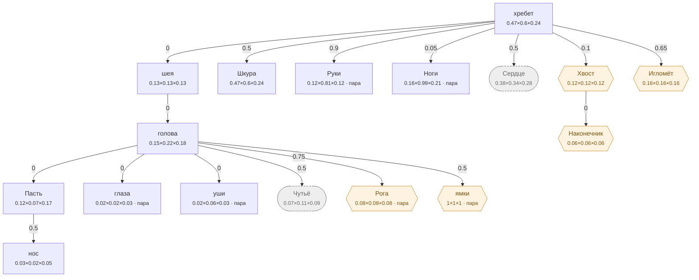

# Человек — план тела

<!-- ВЫГРУЖЕНО из SpeciesSO командой «Chimera → Выгрузить схемы тел». Руками не править. -->

```text
хребет (форму даёт СКЕЛЕТ)   [0.47×0.6×0.24]
├─ шея (форму даёт СКЕЛЕТ)  attach 0   [0.126×0.134×0.126]
│  └─ голова (форму даёт СКЕЛЕТ)  attach 0   [0.146×0.224×0.176]
│     ├─ Пасть  attach 0   [0.12×0.072×0.17]
│     │  └─ нос  attach 0.5   [0.032×0.021×0.053]
│     ├─ глаза (пара)  attach 0   [0.019×0.015×0.029]
│     ├─ уши (пара)  attach 0   [0.019×0.058×0.034]
│     ├─ Чутьё (внутр.)  attach 0.5   [0.073×0.112×0.088]
│     ├─ Рога (графт) (пара)  attach 0.75   [0.082×0.083×0.081]
│     └─ ямки (графт) (пара)  attach 0.5   [1×1×1]
├─ Шкура (форму даёт СКЕЛЕТ)  attach 0.5   [0.47×0.6×0.24]
├─ Руки (форму даёт СКЕЛЕТ) (пара)  attach 0.9   [0.115×0.81×0.12]
├─ Ноги (форму даёт СКЕЛЕТ) (пара)  attach 0.05   [0.16×0.985×0.21]
├─ Сердце (внутр.) (форму даёт СКЕЛЕТ)  attach 0.5   [0.38×0.34×0.28]
├─ Хвост (графт)  attach 0.1   [0.12×0.12×0.12]
│  └─ Наконечник (графт)  attach 0   [0.06×0.06×0.06]
└─ Игломёт (графт)  attach 0.65   [0.16×0.16×0.16]
```

## Скелет

Костей: **40** — скелет 40 · мышцы 0 · признаки 0 · резы 0. Оболочку строит `BoneMesher` полем, один меш на слот.

```text
хребет  (кость · хребет)  0.19 м
├─ пояс1  (кость · хребет)  0.122 м
│  ├─ ягодица  (кость · хребет · пара)  0.086 м
│  └─ бедро  (кость · Ноги · пара)  0.463 м
│     ├─ бедро1  (кость · Ноги · пара)  0.101 м
│     ├─ бедро2  (кость · Ноги · пара)  0.1 м
│     ├─ бедро3  (кость · Ноги · пара)  0.1 м
│     ├─ бедро4  (кость · Ноги · пара)  0.104 м
│     └─ голень  (кость · Ноги · пара)  0.418 м
│        ├─ голень1  (кость · Ноги · пара)  0.068 м
│        ├─ голень2  (кость · Ноги · пара)  0.061 м
│        ├─ голень3  (кость · Ноги · пара)  0.081 м
│        ├─ голень4  (кость · Ноги · пара)  0.101 м
│        ├─ голень5  (кость · Ноги · пара)  0.06 м
│        ├─ голень6  (кость · Ноги · пара)  0.075 м
│        └─ икра  (кость · Ноги · пара)  0.096 м
├─ пояс2  (кость · хребет)  0.12 м
├─ грудь1  (кость · Сердце)  0.064 м
├─ грудь2  (кость · Сердце)  0.062 м
│  ├─ шея  (кость · шея)  0.183 м
│  │  ├─ трапеция  (кость · шея · пара)  0.17 м
│  │  └─ голова  (кость · голова)  0.082 м
│  │     ├─ челюсть  (кость · голова · пара)  0.103 м
│  │     ├─ морда  (кость · голова)  0.044 м
│  │     └─ надбровье  (кость · голова · пара)  0.04 м
│  └─ лопатка  (кость · Руки · пара)  0.139 м
│     ├─ дельта-перед  (кость · Руки · пара)  0.124 м
│     ├─ дельта  (кость · Руки · пара)  0.123 м
│     ├─ дельта-зад  (кость · Руки · пара)  0.123 м
│     └─ плечо  (кость · Руки · пара)  0.32 м
│        ├─ плечо1  (кость · Руки · пара)  0.063 м
│        ├─ плечо2  (кость · Руки · пара)  0.064 м
│        ├─ плечо3  (кость · Руки · пара)  0.067 м
│        └─ предплечье  (кость · Руки · пара)  0.27 м
│           ├─ предплечье1  (кость · Руки · пара)  0.066 м
│           ├─ предплечье2  (кость · Руки · пара)  0.066 м
│           ├─ предплечье3  (кость · Руки · пара)  0.069 м
│           └─ предплечье4  (кость · Руки · пара)  0.069 м
└─ грудь3  (кость · Сердце)  0.06 м
   └─ грудная  (кость · Сердце · пара)  0.112 м
```



**Овал** — внутреннее место (слот есть, на теле не видно). **Гексагон** — закрытое: пустым не рисуется, проступает привитым органом. **Двойная рамка** — цепь звеньев. Цифра на стрелке — `attach`: доля вдоль длинной оси родителя.

| место | родитель | attach | калибр | своя форма | родной орган |
|---|---|---|---|---|---|
| **хребет** | — корень | — | 0.47×0.6×0.24 | — | Хребет |
| **нос** | Пасть | 0.5 | 0.032×0.021×0.053 | — | — |
| **голова** | шея | 0 | 0.146×0.224×0.176 | 10 част. | — |
| **Пасть** | голова | 0 | 0.12×0.072×0.17 | 1 част. | Рот |
| **глаза** | голова | 0 | 0.019×0.015×0.029 | 1 част. | — |
| **уши** | голова | 0 | 0.019×0.058×0.034 | — | — |
| **шея** | хребет | 0 | 0.126×0.134×0.126 | 3 част. | — |
| **Шкура** | хребет | 0.5 | 0.47×0.6×0.24 | 4 част. | Кожа |
| **Руки** | хребет | 0.9 | 0.115×0.81×0.12 | — | Кисть |
| **Ноги** | хребет | 0.05 | 0.16×0.985×0.21 | — | Ноги |
| **Сердце** *(внутр.)* | хребет | 0.5 | 0.38×0.34×0.28 | 3 част. | Сердце |
| **Чутьё** *(внутр.)* | голова | 0.5 | 0.073×0.112×0.088 | — | Чутьё |
| **Хвост** *(графт)* | хребет | 0.1 | 0.12×0.12×0.12 | — | — |
| **Рога** *(графт)* | голова | 0.75 | 0.082×0.083×0.081 | — | — |
| **Наконечник** *(графт)* | Хвост | 0 | 0.06×0.06×0.06 | — | — |
| **Игломёт** *(графт)* | хребет | 0.65 | 0.16×0.16×0.16 | — | — |
| **ямки** *(графт)* | голова | 0.5 | 1×1×1 | — | — |

### Запас длинной оси

Ось выбирается по максимальной стороне РАЗРЕШЁННОГО размера (свой габарит либо доля родителя). Мал запас — правка размера переключит ось и развернёт ветку детей (ловится только глазом).

| место с детьми | ось | запас |
|---|---|---|
| хребет | Y | 21.7% |
| голова | Y | 21.4% |
| Пасть | Z | 29.4% |
| шея | Y | 5.8% |
| Хвост | Y | 0% ⚠️ хрупко |
