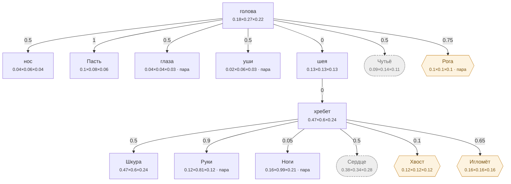

# Человек — план тела

<!-- ВЫГРУЖЕНО из SpeciesSO командой «Chimera → Выгрузить схемы тел». Руками не править. -->

```text
голова   [0.178×0.27×0.216]
├─ нос  attach 0.5   [0.036×0.059×0.039]
├─ Пасть  attach 1   [0.1×0.08×0.06]
├─ глаза (пара)  attach 0.5   [0.035×0.035×0.035]
├─ уши (пара)  attach 0.5   [0.022×0.062×0.032]
├─ шея  attach 0   [0.126×0.134×0.126]
│  └─ хребет  attach 0   [0.47×0.6×0.24]
│     ├─ Шкура  attach 0.5   [0.47×0.6×0.24]
│     ├─ Руки (пара)  attach 0.9   [0.115×0.81×0.12]
│     ├─ Ноги (пара)  attach 0.05   [0.16×0.985×0.21]
│     ├─ Сердце (внутр.)  attach 0.5   [0.38×0.34×0.28]
│     ├─ Хвост (графт)  attach 0.1   [0.12×0.12×0.12]
│     └─ Игломёт (графт)  attach 0.65   [0.16×0.16×0.16]
├─ Чутьё (внутр.)  attach 0.5   [0.089×0.135×0.108]
└─ Рога (графт) (пара)  attach 0.75   [0.1×0.1×0.1]
```



**Овал** — внутреннее место (слот есть, на теле не видно). **Гексагон** — закрытое: пустым не рисуется, проступает привитым органом. **Двойная рамка** — цепь звеньев. Цифра на стрелке — `attach`: доля вдоль длинной оси родителя.

| место | родитель | attach | калибр | своя форма | родной орган |
|---|---|---|---|---|---|
| **хребет** | шея | 0 | 0.47×0.6×0.24 | — | Хребет |
| **нос** | голова | 0.5 | 0.036×0.059×0.039 | — | — |
| **голова** | — корень | — | 0.178×0.27×0.216 | 10 част. | — |
| **Пасть** | голова | 1 | 0.1×0.08×0.06 | 1 част. | Рот |
| **глаза** | голова | 0.5 | 0.035×0.035×0.035 | 1 част. | — |
| **уши** | голова | 0.5 | 0.022×0.062×0.032 | — | — |
| **шея** | голова | 0 | 0.126×0.134×0.126 | 3 част. | — |
| **Шкура** | хребет | 0.5 | 0.47×0.6×0.24 | 4 част. | Кожа |
| **Руки** | хребет | 0.9 | 0.115×0.81×0.12 | — | Кисть |
| **Ноги** | хребет | 0.05 | 0.16×0.985×0.21 | — | Ноги |
| **Сердце** *(внутр.)* | хребет | 0.5 | 0.38×0.34×0.28 | 3 част. | Сердце |
| **Чутьё** *(внутр.)* | голова | 0.5 | 0.089×0.135×0.108 | — | Чутьё |
| **Хвост** *(графт)* | хребет | 0.1 | 0.12×0.12×0.12 | — | — |
| **Рога** *(графт)* | голова | 0.75 | 0.1×0.1×0.1 | — | — |
| **Игломёт** *(графт)* | хребет | 0.65 | 0.16×0.16×0.16 | — | — |

### Запас длинной оси

Ось выбирается по максимальной стороне РАЗРЕШЁННОГО размера (свой габарит либо доля родителя). Мал запас — правка размера переключит ось и развернёт ветку детей (ловится только глазом).

| место с детьми | ось | запас |
|---|---|---|
| хребет | Y | 21.7% |
| голова | Y | 20% |
| шея | Y | 5.9% |
